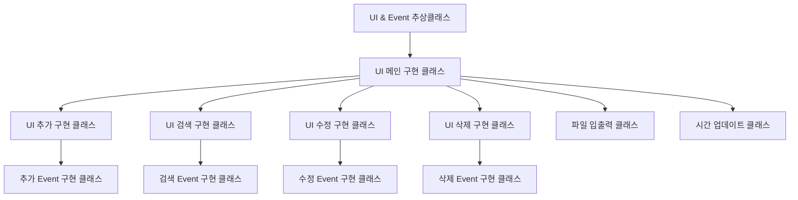

# Java 프로젝트

## 참고 클래스

### JFrame

#### setLocation() 메소드

: 자신의 화면에서 해당 윈도우를 나타낼 위치 지정

```java
package project_resources;

import javax.swing.*;

public class SetLocationFrame {
    public static void main(String[] args) {
        // 창의 타이틀
        JFrame frame = new JFrame("Hello World!");
        
        // 창이 나오는 위치
        frame.setLocation(200, 400);
        
        // JFrame의 내용물에 알맞게 윈도우 크기를 조절해준다.
        frame.pack();
        
        // 보이게 하기
        frame.setVisible(true);
    }
}
```

<br>

#### setPreferredSize(), Dimension 클래스

: 윈도우의 크기를 지정할 수 있다.

```java
package project_resources;

import javax.swing.*;
import java.awt.*;

public class SetDimension {
    public static void main(String[] args) {
        // Dimension 객체에 윈도우 창 크기 저장
        Dimension dim = new Dimension(500, 300);

        JFrame frame = new JFrame("Hello World!");
        frame.setLocation(200, 400);
        
        // 윈도우 창 크기 저장시켜주기
        frame.setPreferredSize(dim);
        frame.pack();
        frame.setVisible(true);
    }
}
```

<br>

### JLabel

#### add() 메소드

: 윈도우에 올리기

```java
package project_resources.jlabel;

import javax.swing.*;
import java.awt.*;

public class Add {
    public static void main(String[] args) {
        Dimension dim = new Dimension(200, 100);

        JFrame frame = new JFrame("Hello!");
        frame.setLocation(200, 400);
        frame.setPreferredSize(dim);

        // JLabel 객체에 메시지를 넣어 생성한다.
        JLabel label = new JLabel("Welcome to Java");

        // 라벨을 윈도우에 추가한다.
        frame.add(label);
        frame.pack();
        frame.setVisible(true);
    }
}
```

<br>

#### setText() 메소드

: 문자열을 윈도우에 띄워주는 메소드

```java
package project_resources.jlabel;

import javax.swing.*;
import java.awt.*;

public class SetText {
    public static void main(String[] args) {
        Dimension dim = new Dimension(200, 100);

        JFrame frame = new JFrame("Hello!");
        frame.setLocation(200, 400);

        frame.setPreferredSize(dim);

        JLabel label = new JLabel();
        
        // 텍스트를 저장한다.
        label.setText("set Text Test");
        
        // 텍스트를 띄운다.
        frame.add(label);
        
        
        frame.pack();
        frame.setVisible(true);
    }
}
```

<br>

#### getText() 메소드

: 텍스트를 불러와서 Run에 띄워준다.

```java
package project_resources.jlabel;

import javax.swing.*;
import java.awt.*;

public class GetText {

    public static void main(String[] args) {
        Dimension dim = new Dimension(200, 100);

        JFrame frame = new JFrame("Hello!");
        frame.setLocation(200, 400);

        frame.setPreferredSize(dim);

        JLabel label = new JLabel();

        // 텍스트를 저장한다.
        label.setText("set Text Test");

        // 텍스트를 윈도우에 띄운다.
        frame.add(label);

        frame.pack();
        frame.setVisible(true);

        // 텍스트를 Run에 띄운다.
        System.out.println(label.getText());
    }
}
```

<br>

#### setVerticalAlignment(), setHorizontalAlignment()

: 세로 정렬, 가로 정렬 메소드

```java
package project_resources.jlabel;

import javax.swing.*;
import java.awt.*;

public class GetText {
    public static void main(String[] args) {
        Dimension dimension = new Dimension(200, 100);

        JFrame frame = new JFrame("Hello!");
        frame.setLocation(200, 400);
        frame.setPreferredSize(dimension);

        JLabel label = new JLabel();
        label.setText("setText Test");
        
        // 세로 아래 정렬
        label.setVerticalAlignment(SwingConstants.BOTTOM);
        
        // 가로 오른쪽 정렬
        label.setHorizontalAlignment(SwingConstants.RIGHT);

        frame.add(label);
        frame.pack();
        frame.setVisible(true);
    }
}	
```

<br>

### JButton

#### add() 메소드

: 버튼을 윈도우에 추가한다.

```java
package project_resources.jbutton;

import javax.swing.*;
import java.awt.*;

public class Add {
    public static void main(String[] args) {
        Dimension dimension = new Dimension(400, 100);

        JFrame frame = new JFrame("Hello");
        frame.setLocation(200, 400);
        frame.setPreferredSize(dimension);
        
        // 버튼 객체 생성
        JButton button = new JButton("Test");
        // 버튼 추가
        frame.add(button);

        frame.pack();
        frame.setVisible(true);
    }
}
```

<br>

#### setText()

: **button.setText("hello!");** 로 버튼의 텍스트를 지정해준다.

<br>

#### getText()

: **button.getText()** 로 버튼의 텍스트를 프로그램의 콘솔에 출력시킨다.

<br>

#### setVerticalAlignment(), setHorizontalAlignment()

: 세로 정렬, 가로 정렬 메소드

<br>

#### ActionListener()

: 버튼 클릭의 이벤트 처리

```java
package project_resources.jbutton;

import javax.swing.*;
import java.awt.*;
import java.awt.event.ActionEvent;
import java.awt.event.ActionListener;

public class ActionListenerMethod {
    public static void main(String[] args) {
        Dimension dimension = new Dimension(400, 100);

        JFrame frame = new JFrame("Hello");
        frame.setLocation(200, 400);
        frame.setPreferredSize(dimension);

        // Grid 레이아웃 객체 1열, 2행으로 추가
        GridLayout layout = new GridLayout(1, 2);
        frame.setLayout(layout);

        // JLabel 객체의 텍스트를 0으로 생성
        JLabel label = new JLabel("0");
        frame.add(label);

        // JButton 객체의 텍스트를 Click Counter로 생성
        JButton button = new JButton("Click Counter");
        frame.add(button);

        // 버튼 이벤트 처리 메소드
        ActionListener listener = new ActionListener() {
            @Override
            // setText로 글씨를 바꾼다.
            public void actionPerformed(ActionEvent e) {
                label.setText(String.valueOf(Integer.valueOf(label.getText()) + 1));
            }
        };
        button.addActionListener(listener);

        frame.add(button);
        frame.pack();
        frame.setVisible(true);
    }
}
```

<br>

### BorderLayout

: 동, 서, 남, 북, 중앙으로 UI를 배치시킬 수 있는 레이아웃

```java
package project_resources.border_lauyout;

import javax.swing.*;
import java.awt.*;

public class BorderLayoutClass {
    public static void main(String[] args) {
        Dimension dimension = new Dimension(400, 100);

        JFrame frame = new JFrame("Hello");
        frame.setLocation(200, 400);
        frame.setPreferredSize(dimension);

        // 라벨 객체 "북" 내용물 중앙으로 생성, 베경 노란색
        JLabel label1 = new JLabel("북");
        label1.setHorizontalAlignment(SwingConstants.CENTER);
        label1.setHorizontalAlignment(SwingConstants.CENTER);
        label1.setOpaque(true);
        label1.setBackground(Color.YELLOW);

        JLabel label2 = new JLabel("서서서서");
        label2.setHorizontalAlignment(SwingConstants.CENTER);
        label2.setVerticalAlignment(SwingConstants.CENTER);
        label2.setOpaque(true);
        label2.setBackground(Color.RED);

        JLabel label3 = new JLabel("동동");
        label3.setHorizontalAlignment(SwingConstants.CENTER);
        label3.setVerticalAlignment(SwingConstants.CENTER);
        label3.setOpaque(true);
        label3.setBackground(Color.BLUE);

        JButton button = new JButton("남");

        JLabel label5 = new JLabel("중앙");

        label5.setHorizontalAlignment(SwingConstants.CENTER);
        label5.setVerticalAlignment(SwingConstants.CENTER);
        label5.setOpaque(true);
        label5.setBackground(Color.WHITE);

        // 동, 서, 남, 북. 가운데 추가
        frame.add(label1, BorderLayout.NORTH);
        frame.add(label2, BorderLayout.WEST);
        frame.add(label3, BorderLayout.EAST);
        frame.add(button, BorderLayout.SOUTH);
        frame.add(label5, BorderLayout.CENTER);

        frame.pack();
        frame.setVisible(true);
    }
}
```

<br>

### JTextField

: 사용자가 임의로 텍스트를 입력할 수 있는 텍스트 박스 추가

#### 텍스트 상자 추가 및 버튼 이벤트 처리

```java
package project_resources.jtextfield;

import javax.swing.*;
import java.awt.*;
import java.awt.event.ActionEvent;
import java.awt.event.ActionListener;

public class AddTextField {
    public static void main(String[] args) {
        // 윈도우 창 크기 값 저장
        Dimension dimension = new Dimension(400, 100);

        // 창의 타이틀 저장 및 프레임 생성
        JFrame frame = new JFrame("Hello!");
        frame.setLocation(200, 400);    // 윈도우 생성 위치
        frame.setPreferredSize(dimension);    // 윈도우 창 크기 설정

        // 텍스트 상자 생성
        JTextField textField = new JTextField();

        // 라벨 텍스트 저장 및 생성
        JLabel label = new JLabel("입력");
        // 라벨 내부 텍스트 위치 설정
        label.setHorizontalAlignment(SwingConstants.CENTER);
        label.setVerticalAlignment(SwingConstants.CENTER);

        // 버튼 텍스트 저장 및 생성
        JButton button = new JButton("OK");
        // 버튼의 이벤트 처리
        button.addActionListener(new ActionListener() {
            @Override
            public void actionPerformed(ActionEvent e) {
                // 텍스트 상자의 텍스트를 가져와서 라벨에 출력시킨다.
                label.setText(textField.getText());
            }
        });

        // 텍스트 상자 가운데 위치
        // 라벨 북쪽 위치
        // 버튼 남쪽 위치
        frame.add(textField, BorderLayout.CENTER);
        frame.add(label, BorderLayout.NORTH);
        frame.add(button, BorderLayout.SOUTH);
        
        frame.pack();
        frame.setVisible(true);
    }
}
```

<br>

#### setEnabled() 메소드

```java
package project_resources.jtextfield;

import javax.swing.*;
import java.awt.*;
import java.awt.event.ActionEvent;
import java.awt.event.ActionListener;

public class SetEnabledMethod {
    public static void main(String[] args) {
        Dimension dimension = new Dimension(400, 100);

        JFrame frame = new JFrame("Hello");
        frame.setLocation(200, 400);
        frame.setPreferredSize(dimension);

        JTextField textField = new JTextField();
        textField.setText("미리 설정");
        textField.setEnabled(false);    // 텍스트 상자를 비활성화 시킨다.

        JLabel jLabel = new JLabel("입력");
        jLabel.setHorizontalAlignment(SwingConstants.CENTER);
        jLabel.setVerticalAlignment(SwingConstants.CENTER);

        JButton button = new JButton("OK");
        button.addActionListener(new ActionListener() {
            @Override
            public void actionPerformed(ActionEvent e) {
                jLabel.setText(textField.getText());
            }
        });

        frame.add(textField, BorderLayout.CENTER);
        frame.add(button, BorderLayout.SOUTH);
        frame.add(jLabel, BorderLayout.NORTH);

        frame.pack();
        frame.setVisible(true);
    }
}
```

<br>

#### KeyListener() 메소드

```java
package project_resources.jtextfield;

import javax.swing.*;
import java.awt.*;
import java.awt.event.KeyEvent;
import java.awt.event.KeyListener;

public class KeyListenerMethod {
    public static void main(String[] args) {
        Dimension dimension = new Dimension(400, 100);

        JFrame frame = new JFrame("Hello");
        frame.setLocation(400, 200);
        frame.setPreferredSize(dimension);

        JTextField textField = new JTextField();
        textField.setToolTipText("도움말");
        
        // 텍스트 박스 이벤트 처리
        KeyListener listener = new KeyListener() {
            @Override
            public void keyTyped(KeyEvent e) {
                // 키를 눌렀을 시 호출됨(단 문자킹만 반응)
                System.out.println("KeyTyped: " + e.getKeyChar());
            }

            @Override
            public void keyPressed(KeyEvent e) {
                // 키를 떼었을 시 호출됨
                System.out.println("KeyPressed: " + e.getKeyChar());
            }

            @Override
            public void keyReleased(KeyEvent e) {
                // 키를 눌었을 시 호출됨
                System.out.println("KeyReleased: " + e.getKeyChar());
            }
        };

        // 텍스트에 이벤트 처리 추가
        textField.addKeyListener(listener);

        frame.add(textField, BorderLayout.CENTER);
        frame.pack();
        frame.setVisible(true);
    }
}
```

<br>

### JPanel

: 보조 프레임. UI의 배치를 할 수 있다.

```java
package project_resources.jpanel;

import javax.swing.*;
import java.awt.*;

public class AddJPanel {
    public static void main(String[] args) {
        Dimension dimension = new Dimension(800, 150);

        JFrame frame = new JFrame("Hello");
        frame.setLocation(200, 400);

        // 1 패널에 레이아웃과 라벨, 텍스트 상자 추가
        JPanel panel1 = new JPanel();
        panel1.setLayout(new BoxLayout(panel1, BoxLayout.X_AXIS));
        panel1.add(new JLabel("이름: "));
        panel1.add(new JTextField());

        // 2 패널에 레이아웃과 라벨, 텍스트 상자 추가
        JPanel panel2 = new JPanel();
        panel2.setLayout(new BoxLayout(panel2, BoxLayout.X_AXIS));
        panel2.add(new JLabel("나이: "));
        panel2.add(new JTextField());

        // 3 패널에 레이아웃과 라벨, 텍스트 상자 추가
        JPanel panel3 = new JPanel();
        panel3.setLayout(new BoxLayout(panel3, BoxLayout.X_AXIS));
        panel3.add(new JLabel("주소: "));
        panel3.add(new JTextField());

        // 4 패널에 레이아웃과 패널들을 추가
        JPanel panel4 = new JPanel();
        panel4.setLayout(new BoxLayout(panel4, BoxLayout.Y_AXIS));
        panel4.add(panel1);
        panel4.add(panel2);
        panel4.add(panel3);

        // 프레임에 패널을 추가하고 버튼 남쪽에 추가
        frame.add(panel4, BorderLayout.CENTER);
        frame.add(new JButton("입력하기"), BorderLayout.SOUTH);
        frame.pack();
        frame.setVisible(true);
    }
}
```

<br>

### JTable

```java
package project_resources.jtable;

import javax.swing.*;
import java.awt.*;

public class Add {
    public static void main(String[] args) {
        Dimension dimension = new Dimension(400, 150);

        JFrame frame = new JFrame("Hello");
        frame.setLocation(200, 400);
        frame.setPreferredSize(dimension);

        // 테이블의 헤더와 내용 정보 정의
         String header[] = {"학생이름", "국어", "영어", "수학"};
         String contents[][] = {
                 {"박영수", "90", "87", "98"},
                 {"김영희", "100", "99", "100"},
                 {"김철수", "30", "25", "9"}
         };

         // 테이블 클래스의 객체 생성
         JTable table = new JTable(contents, header);
         // UI 들이 칸이 부족하면 위 아래로 스크롤을 제공하여 보여준다.
         JScrollPane scrollPane = new JScrollPane(table);

         // 테이블의 1, 1 위치의 값 변경
         table.setValueAt("200", 1, 1);
         // 테이블의 1, 1 위치의 값 가져오기
        System.out.println(table.getValueAt(1, 1));

        // 테이블의 행을 가져온다.
        System.out.println(table.getRowCount());
        
        // 테이블의 컬럼 개수를 가져온다.
        System.out.println(table.getColumnCount());
        
        // 컬럼의 0번 째를 호출한다.
        System.out.println(table.getColumnName(0));

         frame.add(scrollPane);
         frame.pack();
         frame.setVisible(true);
    }
}
```

<br>

#### 행 단위로 데이터를 삽입/ 삭제

```java
package project_resources.jtable;

import javax.swing.*;
import javax.swing.table.DefaultTableModel;
import java.awt.*;
import java.awt.event.ActionEvent;
import java.awt.event.ActionListener;

public class InsertAndRemove {
    public static void main(String[] args) {
        Dimension dimension = new Dimension(400, 300);

        JFrame frame = new JFrame("Hello");
        frame.setLocation(200, 400);
        frame.setPreferredSize(dimension);

        String header[] = {"학생이름", "국어", "영어", "수학"};
        String contents[][] = {
                {"박영수", "90", "87", "98"},
                {"김영희", "100", "99", "100"},
                {"김철수", "30", "25", "9"}
        };

        // 객체를 생성하여 초기값을 넣고, model 객체를 통해
        // 데이터를 테이블에 입력, 삭제한다.
        DefaultTableModel model = new DefaultTableModel(contents, header);
        JTable table = new JTable(model);
        JScrollPane scrollPane = new JScrollPane(table);

        JPanel panel = new JPanel();
        panel.setLayout(new BoxLayout(panel, BoxLayout.X_AXIS));

        // 컴럼 수로 크기 설정
        JTextField nameField = new JTextField(5);
        JTextField subject1 = new JTextField(3);
        JTextField subject2 = new JTextField(3);
        JTextField subject3 = new JTextField(3);

        panel.add(nameField);
        panel.add(subject1);
        panel.add(subject2);
        panel.add(subject3);

        // 버튼 객체 생성
        JButton addbtn = new JButton("추가");

        // 추가 버튼 이벤트 처리
        addbtn.addActionListener(new ActionListener() {
            @Override
            public void actionPerformed(ActionEvent e) {
                String inputStr[] = new String[4];

                inputStr[0] = nameField.getText();
                inputStr[1] = subject1.getText();
                inputStr[2] = subject2.getText();
                inputStr[3] = subject3.getText();
                model.addRow(inputStr);

                nameField.setText("");
                subject1.setText("");
                subject2.setText("");
                subject3.setText("");
            }
        });

        // 삭제 버튼 객체 생성
        JButton cancleBtn = new JButton("삭제");

        // 삭제 버튼 이벤트 처리
        cancleBtn.addActionListener(new ActionListener() {
            @Override
            public void actionPerformed(ActionEvent e) {
                if(table.getSelectedRow() == -1) {
                    return;
                } else {
                    model.removeRow(table.getSelectedRow());
                }
            }
        });

        panel.add(addbtn);
        panel.add(cancleBtn);

        frame.add(scrollPane, BorderLayout.CENTER);
        frame.add(panel, BorderLayout.SOUTH);
        frame.pack();
        frame.setVisible(true);
    }
}
```


## Scheduler 프로젝트

## UI


<br>

## Class & Interface




