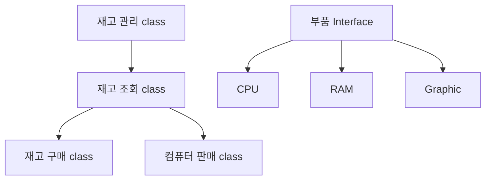

# Java Seminar Project




# 실행 화면

**프로그램 시작**

```
1. 재고 조회
2. 재고 구매
3. 본체 제작
4. 본체 조회
5. 본체 판매
```


**재고 조회**

```
CPU 재고
1. 제품명 : ~, 성능 : ~, 가격 : ~
2. 
RAM 재고

Graphic Card 재고
```


**재고 구매**

```
구매할 재고가 무엇입니까?
(1) CPU
(2) RAM
(3) Graphic Card
입력 : 

구매할 재고의 제품명을 입력해주세요.(취소: -1)
: 

구매할 재고의 성능을 입력해주세요.(취소: -1)
:

구매할 재고의 가격을 입력해주세요.(취소: -1)
: 
```


**본체 제작**

```
CPU 재고
1. 제품명 : ~, 성능 : ~, 가격 : ~
2. ~

본체에 넣을 CPU를 입력해주세요.
: 

RAM 재고
~

본체에 넣을 RAM 입력해주세요.
: 

Graphic Card 재고
~

본체에 넣을 Graphic Card를 입력해주세요.
: 

본체의 제품명을 입력해주세요.
: 
```


**본체 조회**

```
본체 재고
1. 슈퍼컴퓨터
CPU :
RAM :
Graphic :
가격 : 

2. ~
```


**본체 판매**

```
본채 판매
1. 슈퍼컴퓨터
CPU :
RAM :
Graphic :
가격 : 

2. ~

판매하실 컴퓨터를 입력해주세요.(취소: -1)
: 

```

