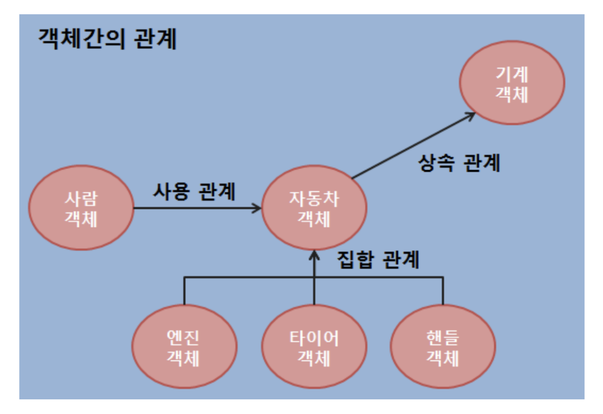
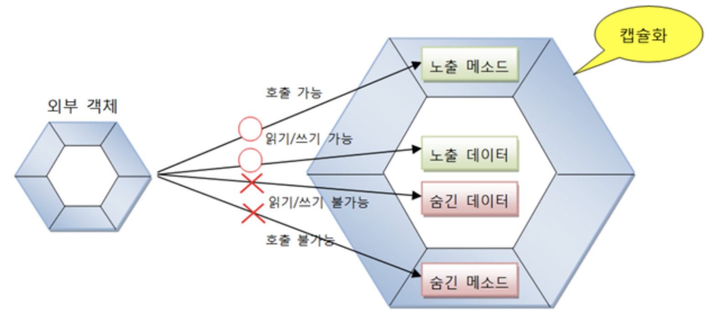
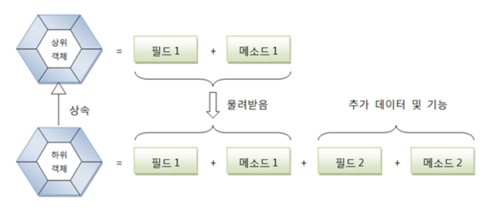
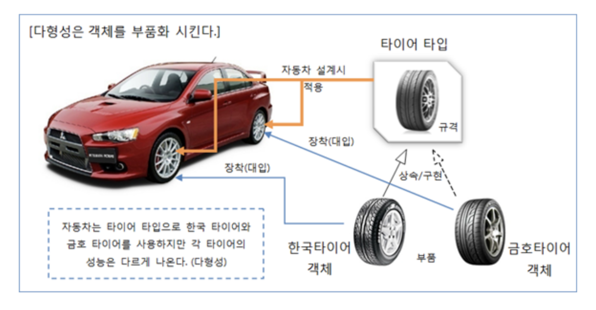

# 설계를 위한 복습

 클래스, 상속, 인터페이스에 대한 개념을 토대로 설계를 해야하기 때문에 복습을 하게 되었다.

# 01. 클래스(Class)

## 객체란?

 자신의 속성을 가지고 있고 다른 것과 식별 가능한 것이고 속성과 동작으로 구성되어 있다.

## 객체 간의 관계

* **관계 종류** : 집합 관계, 사용 관계, 상속 관계

  * **집합 관계** : 부품에 해당한다.
  * **상속 관계** : 상위 객체를 기반으로 하위 객체를 생성하는 관계이다.
  * **사용 관계** : 객체 간의 상호작용을 한다.

  

## 객체 지향 프로그래밍의 특징

### 캡슐화(Encapsulation)

 객체의 필드, 메소드를 하나로 묶고 실제 구현 내용을 감추는 것.

* **캡슐화하는 이유** : 필드와 메소드를 캡슐화하여 보호하기 위해서 이다.

### 상속(Inheritance)

 부모 역할의 상위 객체가 자식 역할의 하위 객체에게 필드와 메소드를 제공하는 것이다.

* **장점 **
  * 상위 객체를 재사용해서 하위 객체를 쉽고 빨리 설계 가능하다.
  * 상위 객체의 수정으로 모든 하위 객체들의 수정하는 효과로 인해 유지 보수 시간 최소화.

### 다형성(Polymorphism)

 같은 타입이지만 실행 결과가 다양한 객체를 이용할 수 있는 성질

* **자바의 다형성**
  * 부모 클래스 또는 인터페이스의 타입 변환이 허용된다.
  * 하나의 타입에 여러 객체를 대입할 수 있다.

# 02. 상속(Inheritance)

 부모 클래스의 멤버를 자식 클래스에게 물려주는 것.

* **특징**
  * 코드의 중복을 줄여준다(개발 시간을 절약시켜준다)
  * 상속을 해도 부모 클래스의 모든 필드와 메소드들을 물려받는 것은 아니다.
  * 수정을 최소화 시킬 수 있다.

## 추상 클래스

* **추상 클래스의 용도**
  * 실체 클래스들의 공통된 필드와 메소드의 이름을 통일할 목적
  * 실체 클래스를 작성할 때 시간을 절약

# 03. 인터페이스(Interface)

 객체의 사용 방법을 정의한 타입

* **역할**
  * 다형성을 구현하는 매우 중요한 역할
  * 개발 코드가 인터페이스의 메소드를 호출하면 인터페이스는 객체의 메소드를 호출시킨다.
  * 개발 코드를 수정하지 않고, 사용하는 객체를 변경하기 위해서

## 다형성

 하나의 타입에 대입되는 객체에 따라서 실행 결과가 다양한 형태로 나오는 성질.

