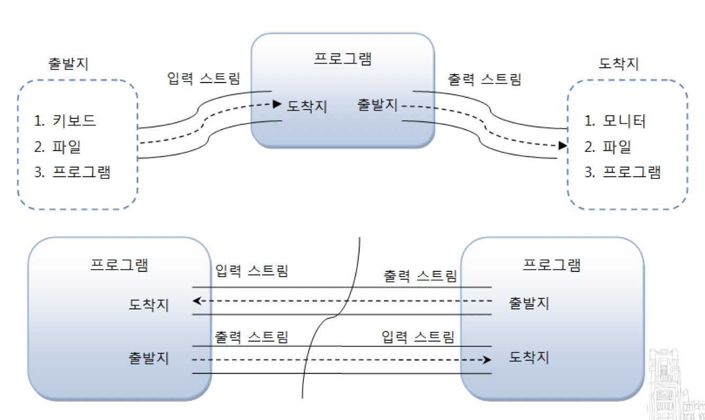
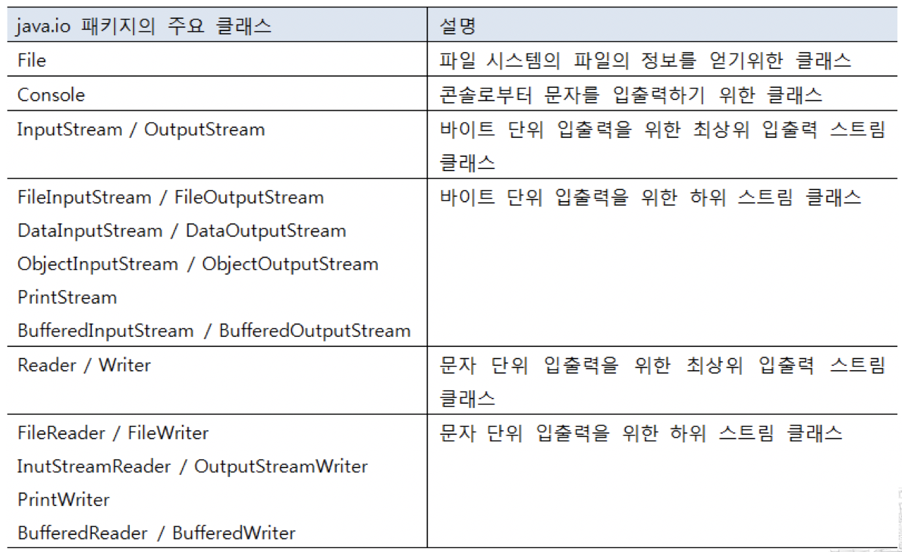
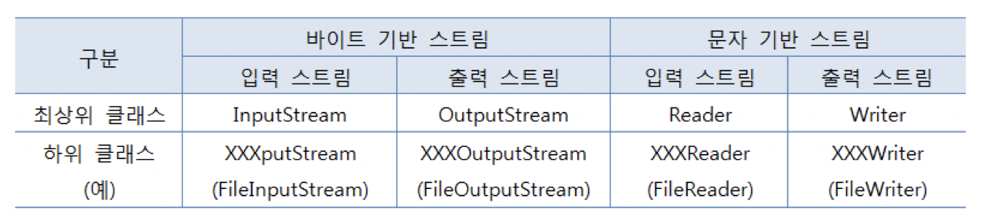
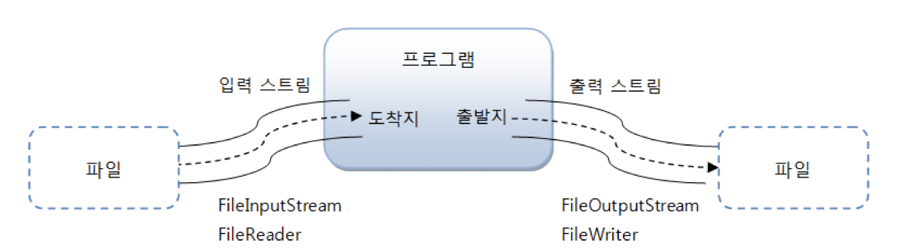
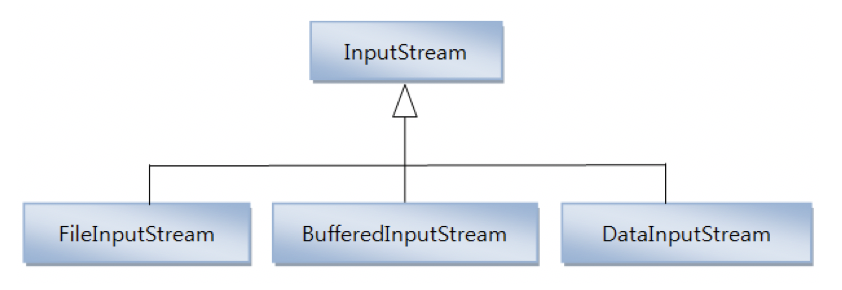
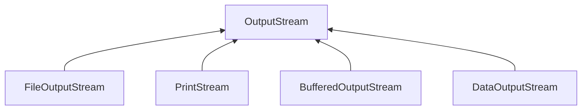
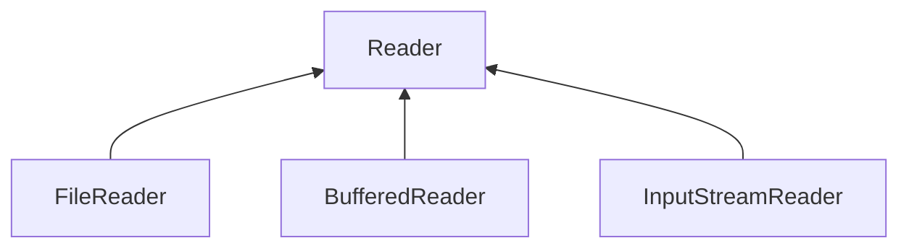
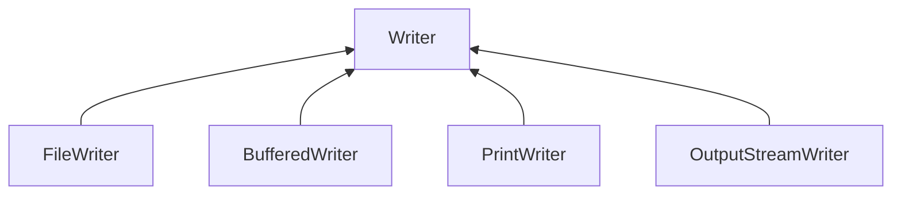

# Chapter 18. IO 기반 입출력 및 네트워킹

# 18.1. IO 패키지 소개

자바에서 데이터는 스트림(Stream)을 통해 입출력되므로 스트림의 특징을 잘 이해해야 한다.


# 18.2. 입력 스트림과 출력 스트림

* **입력 스트림 (InputStream)** : 프로그램이 데이터를 입력받을 때
  * ex) 키보드, 파일, 프로그램
* **출력 스트림 (OutputStream)** : 프로그램이 데이터를 보낼 때
  * ex) 모니터, 파일, 프로그램




자바의 기본적인 데이터 입출력 (IO: Input/Output) API 는 java.io 패키지에서 제공하고 있다.

* **java.io 패키지의 주요 클래스들**

  

* **스트림 클래스 두 종류**
  * 바이트(Byte) 기반 스트림
    * 모든 종류의 데이터
  * 문자(Character) 기반 스트림

* **바이트 기반 스트림과 문자 기반 스트림의 최상위 클래스**

  

* **스트림 입출력 흐름**

  

  > 그림, 멀티미디어, 텍스트 등의 파일을 바이트 단위로 읽어들일 때에는 FileInputStream을 사용하고, 바이트 단위로 저장할 때에는 FileOutputStream을 사용한다.
  >
  > 텍스트 파일의 경우, 문자 단위로 읽어들일 때에는 FileReader를 사용하고, 문자 단위로 저장할 때에는 FileWriter를 사용한다.


## 18.2.1. InputStream

InputStream은 바이트 기반 입력 스트림의 최상위 클래스로 추상 클래스이다. 



* **InputStream 클래스의 주요 메소드들**

  | 리턴타입 | 메소드                            | 설명                                                         |
  | -------- | --------------------------------- | ------------------------------------------------------------ |
  | int      | read()                            | 입력 스트림으로부터 1 바이트를 읽고 읽은 바이트를 리턴한다.  |
  | int      | read(byte[ ] b)                   | 입력 스트림으로부터 읽은 바이트들을 매개값으로<br /> 주어진 바이트 배열 b에 저장하고 실제로 읽은 바이트 수를 리턴한다. |
  | int      | read(byte[ ] b, int off, int len) | 입력 스트림으로부터 len 개의 바이트 만큼 읽고 매개값으로 주어진 바이트 배열 b[off] 부터 len 개 까지 저장한다.<br />그리고 실제로 읽은 바이트 수인 len 개를 리턴한다. <br />만약 len 개를 모두 읽지 못하면 실제로 읽은 바이트 수를 리턴한다. |
  | void     | close()                           | 사용한 시스템 자원을 반납하고 입력 스트림을 닫는다.          |


### read() 메소드

1바이트 씩 읽고 그 바이트 리턴

```java
package input_stream;

import java.io.*;

public class Read {

    public static void main(String[] args) throws IOException {

        String current = new java.io.File(".").getCanonicalPath();

        InputStream is = new FileInputStream(current + "/test.txt");
        int readByte;

        // read() 메소드
        while ((readByte=is.read()) != -1) {
            System.out.print(readByte + " ");
        }
        System.out.println();
    }
}
```

**실행결과**

```
49 50 51 52 10 49 50 51 52 10 49 50 51 52 10
```


### read(byte[ ] b) 메소드

읽은 바이트를 매개변수인 바이트 배열에 저장하고 파일의 마지막에 도달하면 전체 바이트 수를 리턴한다.

```java
package input_stream;

import java.io.FileInputStream;
import java.io.IOException;
import java.io.InputStream;

public class ReadBytes {

    public static void main(String[] args) throws IOException {

        String current = new java.io.File(".").getCanonicalPath();

        InputStream is = new FileInputStream(current + "/test.txt");

        // read(byte[] b) 메소드
        byte[] readBytes = new byte[100];
        int readByteNo;
        while ((readByteNo=is.read(readBytes)) != -1) {
            System.out.print(readByteNo + " ");
        }
        System.out.println();

        for(int i=0; i < 15; i++) {
            System.out.print(readBytes[i] + " ");
        }
    }
}
```

**실행결과**

```
15 
49 50 51 52 10 49 50 51 52 10 49 50 51 52 10
```


### read(byte[ ] b, int off, int len)

len개의 바이트만큼 읽고, 읽은 바이트를 매개변수인 바이트 배열에 저장하고 파일의 마지막에 도달하면 전체 바이트 수를 리턴한다.

```java
package input_stream;

import java.io.FileInputStream;
import java.io.IOException;
import java.io.InputStream;

public class ReadBytesOffLen {

    public static void main(String[] args) throws IOException {
        String current = new java.io.File(".").getCanonicalPath();

        InputStream is = new FileInputStream(current + "/test.txt");

        byte[] readBytes = new byte[100];
        int readByteNo;
        while((readByteNo = is.read(readBytes, 0, 100)) != -1) {
            System.out.print(readByteNo + " ");
        }

        System.out.println();

        for(int i=0; i < 15; i++) {
            System.out.print(readBytes[i] + " ");
        }
    }
}
```

**실행결과**

```
15 
49 50 51 52 10 49 50 51 52 10 49 50 51 52 10
```


### close() 메소드

더 이상 InputStream을 사용하지 않을 때 시스템 자원을 풀어준다.

```java
is.close();
```


## 18.2.2. OutputStream

OutputStream은 **바이트 기반 출력 스트림** 의 최상위 클래스로 추상 클래스이다.




* **OutputStream 클래스 주요 메소드들**

  | 리턴 타입 | 메소드                             | 설명                                                         |
  | --------- | ---------------------------------- | ------------------------------------------------------------ |
  | void      | write(int b)                       | 출력 스트림으로 1 바이트를 보낸다.                           |
  | void      | write(byte[ ] b)                   | 출력 스트림으로 주어진 바이트 배열 b의 모든 바이트를 보낸다. |
  | void      | write(byte[ ] b, int off, int len) | 출력 스트림으로 주어진 바이트 배열 b[off]부터 len개 까지의 바이트를 보낸다. |
  | void      | flush()                            | 버퍼에 잔류하는 모든 바이트를 출력한다.                      |
  | void      | close()                            | 사용한 시스템 자원을 반납하고 출력 스트림을 닫는다.          |


### write(int b) 메소드

1 바이트 씩 파일에 출력시킨다.

```java
package output_stream;

import java.io.*;

public class Write {
    public static void main(String[] args) throws IOException {
        String current = new java.io.File(".").getCanonicalPath();
        OutputStream os = new FileOutputStream(current + "/test_write.txt");

        byte[] data = "ABC".getBytes();

        for (int i=0; i<data.length; i++) {
            os.write(data[i]);  // A, B, C 를 하나씩 출력
        }
    }
}
```


### write(byte[] b) 메소드

바이트 배열의 모든 바이트를 파일에 출력시킨다.

```java
package output_stream;

import java.io.File;
import java.io.FileOutputStream;
import java.io.IOException;
import java.io.OutputStream;

public class WriteBytes {
    public static void main(String[] args) throws IOException {
        String current = new java.io.File(".").getCanonicalPath();
        OutputStream os = new FileOutputStream(current + "/test_write.txt");

        byte[] data = "ABC".getBytes();
        os.write(data);		// 바이트 전체 출력
    }
}
```


### write(byte[] b, int off, int lne) 메소드

b[off] 부터 len 개의 바이트를 파일에 출력시킨다.

```java
package output_stream;

import java.io.FileOutputStream;
import java.io.IOException;
import java.io.OutputStream;

public class WriteBytesOffLength {
    public static void main(String[] args) throws IOException {
        String current = new java.io.File(".").getCanonicalPath();
        OutputStream os = new FileOutputStream(current + "/test_write.txt");

        byte[] data = "ABC".getBytes();
        os.write(data, 1, 2);	// 1 번째 부터 2 번째 까지 바이트 출력
    }
}
```


### flush() 와 close() 메소드

* **flush()** : 버퍼에 잔류하고 있는 버퍼들을 비워주는 역할.
* **close()** : OutputStream을 더 이상 사용하지 않을 경우에 사용.

```java
package output_stream;

import java.io.FileNotFoundException;
import java.io.FileOutputStream;
import java.io.IOException;
import java.io.OutputStream;

public class FlushClose {
    public static void main(String[] args) throws IOException {
        String current = new java.io.File(".").getCanonicalPath();
        OutputStream os = new FileOutputStream(current + "/test_write.txt");

        byte[] data = "ABC".getBytes();
        os.write(data, 1, 2);
        os.flush();     // 버퍼를 비운다.
        os.close();     // OutputStream을 종료한다.
    }
}
```


## 18.2.3. Reader

Reader는 **문자 기반 입력 스트림** 의 최상위 클래스로 추상 클래스이다.




* **Reader 주요 메소드들**

  | 리턴 타입 | 메소드                                | 설명                                                         |
  | --------- | ------------------------------------- | ------------------------------------------------------------ |
  | int       | read( )                               | 입력 스트림으로부터 한 개의 문자를 읽고 리턴.                |
  | int       | read(char[ ] cbuf)                    | 입력 스트림으로부터 읽은 문자들을 매개값으로 주어진 문자 배열 cbuf에 저장하고 실제로 읽은 문자 수를 리턴한다. |
  | int       | read(char[ ] chuff, int off, int len) | len 개의 문자를 읽고 off 부터 len 개까지 저장.               |
  | void      | close( )                              | 시스템 자원 반납 후 입력 스트림 닫음.                        |


### read() 메소드

한 개의 문자(2바이트) 를 읽고 4 바이트 int 타입으로 리턴한다.

```java
package reader;

import java.io.File;
import java.io.FileReader;
import java.io.IOException;
import java.io.Reader;

public class Read {
    public static void main(String[] args) throws IOException {
        String current = new java.io.File(".").getCanonicalPath();
        Reader reader = new FileReader(current + "/test_reader.txt");

        int readData;

        while ((readData = reader.read()) != -1) {	// 한 글자를 읽어와서 저장한다.
            char charData = (char) readData;				// int 타입의 글자를 char 로 변환
            System.out.print(charData + " ");
        }
    }
}
```


### read(char[] cbuf) 메소드

주어진 문자 배열의 길이만큼 문자를 읽고 배열에 저장한다. 그리고 읽은 문자 수를 리턴.

```java
package reader;

import java.io.FileReader;
import java.io.IOException;
import java.io.Reader;

public class ReadCbuf {
    public static void main(String[] args) throws IOException {
        String current = new java.io.File(".").getCanonicalPath();
        Reader reader = new FileReader(current + "/test_reader.txt");

        int readCharNo;
        char[] cbuf = new char[2];

        while ((readCharNo = reader.read(cbuf)) != -1) {
         		// 주어진 배열 2개 만큼 글자를 읽은 후 저장한다.
         		// 그리고 readCharNo 에 읽은 글자 수를 저장한다.
            System.out.print(readCharNo + " " + cbuf[0] + " " + cbuf[1] + "\n");
        }
    }
}
```


### read(char[] cbuf, int off, int len) 메소드

len 개의 문자만큼 읽고 주어진 문자 배열 cbuf[off] 부터 len개까지 저장한다.

```java
package reader;

import java.io.FileReader;
import java.io.IOException;
import java.io.Reader;

public class ReadCbufOffLen {
    public static void main(String[] args) throws IOException {
        String current = new java.io.File(".").getCanonicalPath();
        Reader reader = new FileReader(current + "/test_reader.txt");

        char[] cbuf = new char[100];

        int readCharNo = reader.read(cbuf, 0, 100);	// 0 ~ 100 까지 문자 읽어옴.
        System.out.println(readCharNo);
        
        for (int i=0; i<cbuf.length; i++) {
            if (cbuf[i] != 0)
                System.out.println(cbuf[i]);
        }
    }
}
```


### close() 메소드

Reader를 더 이상 사용하지 않을 경우 호출

```java
reader.close();
```


## 18.2.4. Writer

**문자 기반 출력 스트림의** 최상위 클래스로 추상 클래스이다.




* **Writer 클래스 주요 메소드들**

  | 리턴 타입 | 메소드                                | 설명                                        |
  | --------- | ------------------------------------- | ------------------------------------------- |
  | void      | write(int c)                          | 한 문자를 보낸다.                           |
  | void      | write(char[ ] cbuf)                   | 주어진 문자 배열 cbuf의 모든 문자를 보낸다. |
  | void      | write(char[ ] cbuf, int off, int len) | cbuf[off] 부터 len개 까지의 문자를 보낸다.  |
  | void      | write(String str)                     | 주어진 문자열을 전부 보낸다.                |
  | void      | write(String str, int off, int len)   | 문자열 off 부터 len 개 까지의 문자를 보낸다 |
  | void      | flush()                               | 버퍼에 잔류하는 모든 문자 출력              |
  | void      | close()                               | 출력 스트림을 닫는다.                       |


### write(int c) 메소드

한 문자를 출력시킨다.

```java
package writer;

import java.io.FileWriter;
import java.io.IOException;
import java.io.Writer;

public class Write {
    public static void main(String[] args) throws IOException {
        String current = new java.io.File(".").getCanonicalPath();
        Writer writer = new FileWriter(current + "/writer.txt", true);

        char[] data = "홍길동".toCharArray();

        for (int i=0; i<data.length; i++) {
            writer.write(data[i]);      // 홍, 길, 동 하나씩 출력
        }

        writer.close(); // 반드시 닫아 주어야한다.
    }
}
```


### write(char[ ] cbuf) 메소드

char[] 배열의 모든 문자를 출력

```java
package writer;

import java.io.FileWriter;
import java.io.IOException;
import java.io.Writer;

public class WriterCbuf {
    public static void main(String[] args) throws IOException {
        String current = new java.io.File(".").getCanonicalPath();
        Writer writer = new FileWriter(current + "/test_writer.txt");

        char[] data = "홍길동".toCharArray();

        // 배열 전체 출력
        writer.write(data);
        writer.close();
    }
}
```


### write(char[ ] c, int off, int len) 메소드

c[off] 부터 len 개의 문자를 출력

```java
package writer;

import java.io.FileWriter;
import java.io.IOException;
import java.io.Writer;

public class WriterOffLen {
    public static void main(String[] args) throws IOException {
        String current = new java.io.File(".").getCanonicalPath();
        Writer writer = new FileWriter(current + "/writer.txt", true);

        char[] data = "홍길동".toCharArray();
        
        // 글자 배열의 1부터 2까지 출력
        writer.write(data, 1, 2);
        writer.close();
    }
}
```


### write(String str) 와 write(String str, int off, int lne) 메소드

문자열을 좀 더 쉽게 출력한다.

```java
package writer;

import java.io.FileWriter;
import java.io.IOException;
import java.io.Writer;

public class WriterString {
    public static void main(String[] args) throws IOException {
        String current = new java.io.File(".").getCanonicalPath();
        Writer writer = new FileWriter(current + "/writer.txt");

        String data = "안녕 자바 프로그램";

        // 문자열 출력
        writer.write(data);

        // 문자열 3부터 4번 까지 출력
        writer.write(data, 3, 4);

        writer.flush();
        writer.close();
    }
}
```


# 18.3. 콘솔 입출력

* **콘솔(Console)** : 시스템을 사용하기 위해 키보드로 입력을 받고 화면으로 출력하는 소프트웨어이다.
  * 데이터를 입력받을 때 : System.in
  * 데이터를 출력할 때 : System.out
  * 에러를 출력할 때 : System.err


## 18.3.1. System.in 필드

* System.in 은 InputStream 타입의 필드이므로 InputStream 변수로 참조가 가능하다.

  ```java
  InputStream is = System.in;
  ```

* 키보드로부터 어떤 키가 입력되었는지 확인하려면 InputStream의 read() 메소드로 한 바이트를 읽으면 된다.

  ```java
  int asciiCode = is.read();					// 키 읽기
  char inputChar = (char) is.read();	// 키 변환
  ```

* **예제) 콘솔에서 입력한 번호 알아내기**

  ```java
  package system;
  
  import java.io.IOException;
  import java.io.InputStream;
  
  public class SystemInExample1 {
      public static void main(String[] args) throws IOException {
          System.out.println("== 메뉴 ==");
          System.out.println("1. 예금 조회");
          System.out.println("2. 예금 출금");
          System.out.println("3. 예금 입금");
          System.out.println("4. 종료 하기");
          System.out.print("메뉴를 선택하세요: ");
          
          // 키보드 입력 스트림 얻기
          InputStream is = System.in;
          
          // 아스키 코드를 읽고 문자로 리턴
          char inputChar = (char) is.read();
  
          switch (inputChar) {
              case '1':
                  System.out.println("예금 조회를 선택하셨습니다.");
                  break;
              case '2':
                  System.out.println("예금 출금을 선택하셨습니다.");
                  break;
              case '3':
                  System.out.println("예금 입금을 선택하셨습니다.");
                  break;
              case '4':
                  System.out.println("종료 하기를 선택하셨습니다.");
                  break;
          }
      }
  }
  ```

  **실행 결과**

  ```
  == 메뉴 ==
  1. 예금 조회
  2. 예금 출금
  3. 예금 입금
  4. 종료 하기
  메뉴를 선택하세요: 4
  종료 하기를 선택하셨습니다.
  ```

  > InputStream 의 **read() 메소드는 1바이트만** 읽을 수 있다. 그렇기 때문에 한글을 얻기 위해서는 우선 **read(byte[ ] b) 나 read(byte[ ] b, int off, int len)** 메소드로 바이트 배열을 받고, 이 배열을 이용해서 String 객체를 생성하면 된다.

  ```java
  byte[] byteData = new byte[15];
  int readByteNo = System.in.read(byteData);
  
  // (바이트수 - 2) 를 하는 이유는 Enter키에 해당하는 마지막 두 바이트를 제외하기 위해서이다.
  String strData = new String(byteData, 0, readByteNo-1);
  ```


* **예제) 콘솔에서 입력한 한글 알아내기**

  ```java
  package system;
  
  import java.io.IOException;
  import java.io.InputStream;
  
  public class SystemInExample2 {
      public static void main(String[] args) throws IOException {
          InputStream is = System.in;
  
          byte[] datas = new byte[100];
  
          System.out.println("이름: ");
          int nameBytes = is.read(datas);
          String name = new String(datas, 0, nameBytes-1);
  
          System.out.println("하고 싶은 말: ");
          int commentBytes = is.read(datas);
          String comment = new String(datas, 0, commentBytes-1);
  
          System.out.println("입력한 이름: " + name);
          System.out.println("입력한 하고 싶은말: " + comment);
      }
  }
  ```

  **실행 결과**

  ```
  이름: 
  이상민
  하고 싶은 말: 
  가
  입력한 이름: 이상민
  입력한 하고 싶은말: 가
  ```


## 18.3.2. System.out 필드

* 콘솔로 데이터를 출력하기 위해서는 System 클래스의 out 정적 필드를 사용한다.

* out은 PrintStream 타입의 필드이다.

* OutputStream 의 write(int b) 메소드를 이용.

  ```java
  byte b = 97;
  os.write(b);	// 'a' 출력
  os.flush();
  ```

* 한글을 출력하기 위해서는 우선 한글을 바이트 배열로 얻은 다음, write(byte[ ] b) 나 write(byte[ ] b, int off, int lne) 메소드를 통해 출력한다.

  ```java
  String name = "홍길동";
  byte[] nameBytes = name.getBytes();
  os.write(nameBytes);
  os.flush();
  ```

* **예제) 연속된 숫자, 영어, 한글 출력**

  ```java
  package system;
  
  import java.io.IOException;
  import java.io.OutputStream;
  
  public class SystemOutExample {
      public static void main(String[] args) throws IOException {
          OutputStream os = System.out;
  
          for (byte b = 48; b < 58; b++) {
              // 아스키 코드 48 ~ 57 문자 출력
              os.write(b);
          }
          // 라인피드(10)을 출력하면 다음 행으로 넘어간다.
          os.write(10);
  
          for (byte b = 97; b < 123; b++) {
              os.write(b);
          }
          os.write(10);
  
          String hangul = "가나다라마바사아자차카타파하";
          byte[] hangulBytes = hangul.getBytes();
          os.write(hangulBytes);
  
          os.flush();
      }
  }
  ```

  **실행 결과**

  ```
  0123456789
  abcdefghijklmnopqrstuvwxyz
  가나다라마바사아자차카타파하
  ```


## 18.3.3. Console 클래스

콘솔에서 입력받은 문자열을 쉽게 읽을 수 있도록 java.io.Console 클래스를 제공하고 있다.

```java
Console console = System.console();
```

* **주의할 점**

  이클립스에서 실행하면 System.console() 메소드는 null을 리턴하기 때문에 **반드시 명령 프롬프트에서 실행해야 한다.**

* **Console 읽기 메소드들**

  | 리턴 타입 | 메소드          | 설명                                                  |
  | --------- | --------------- | ----------------------------------------------------- |
  | String    | readLine()      | Enter키를 입력하기 전의 모든 문자열을 읽음            |
  | char[ ]   | readPassword( ) | 키보드 입력 문자를 콘솔에 보여주지 않고 문자열을 읽음 |

* **ex) 아이디와 패스워드를 콘솔로부터 읽음**

  ```java
  package console;
  
  import java.io.Console;
  
  public class ConsoleExample {
      public static void main(String[] args) {
          Console console = System.console();
  
          System.out.print("아이디: ");
          String id = console.readLine();
  
          System.out.print("패스워드: ");
          char[] charPass = console.readPassword();
          String strPassword = new String(charPass);
  
          System.out.println("------------------");
          System.out.println(id);
          System.out.println(strPassword);
      }
  }
  ```


## 18.3.4. Scanner 클래스

Console 클래스는 콘솔로부터 문자열은 읽을 수 있지만 기본 타입(정수, 실수) 값을 바로 읽을 수는 없다. 하지만 Scanner 클래스를 이용하면 기본 타입 값을 가져올 수 있다.

```java
Scanner scanner = new Scanner(System.in);
```


* **Scanner 메소드들**

  | 리턴 타입 | 메소드        | 설명                             |
  | --------- | ------------- | -------------------------------- |
  | boolean   | nextBoolean() | boolean(true/false) 값을 읽는다. |
  | byte      | nextByte()    | Byte 값을 읽는다.                |
  | short     | nextShort()   | Short 값을 읽는다.               |
  | int       | nextInt()     | int 값을 읽는다.                 |
  | long      | nextLong()    | long 값을 읽는다.                |
  | float     | nextFloat()   | float 값을 읽는다.               |
  | double    | nextDouble()  | double 값을 읽는다.              |
  | String    | nextLine()    | String 값을 읽는다.              |

* **예제) 문자열, 정수, 실수를 직접 읽는 예제**

  ```java
  package scanner;
  
  import java.util.Scanner;
  
  public class ScannerExample {
      public static void main(String[] args) {
        // 콘솔 생성
          Scanner scanner = new Scanner(System.in);
  
          System.out.print("문자열 입력> ");
          String inputString = scanner.nextLine();
          System.out.println(inputString);
          System.out.println();
  
          System.out.print("정수 입력> ");
          int inputInt = scanner.nextInt();
          System.out.println(inputInt);
          System.out.println();
  
          System.out.println("실수 입력> ");
          double inputDouble = scanner.nextDouble();
          System.out.println(inputDouble);
      }
  }
  ```

  **실행 결과**

  ```
  문자열 입력> 안녕하세요
  안녕하세요
  
  정수 입력> 12
  12
  
  실수 입력> 
  1.222
  1.222
  ```


# 18.4. 파일 입출력

## 18.4.1. File 클래스

IO 패키지에서 제공하는 File 클래스는 파일 크기, 파일 속성, 파일 이름 등의 정보를 얻어내는 기능과 파일 생성 및 삭제 기능을 제공하고 있다. 그리고 디렉토리를 생성하고 디렉토리에 존재하는 파일 리스트를 얻어내는 기능도 있다.

* **파일 생성 예시**

  ```java
  File file = new File("C:\\Temp\\file.txt");
  File file = new File("C:/Temp/file.txt");
  ```

  > File 객체를 생성했다고 해서 파일이나 디렉토리가 생성되는 것은 아니다.

* **파일 존재 확인 예시**

  ```java
  boolean isExist = file.exists();
  ```

* **파일 및 디렉토리 생성/제거 메소드들**

  | 리턴 타입 | 메소드          | 설명                               |
  | --------- | --------------- | ---------------------------------- |
  | boolean   | createNewFile() | 새로운 파일을 생성                 |
  | boolean   | mkdir()         | 새로운 디렉토리를 생성             |
  | boolean   | mkdirs()        | 경로상에 없는 모든 디렉토리를 생성 |
  | boolean   | delete()        | 파일 또는 디렉토리 삭제            |

* **파일 및 디렉토리 존재 여부 확인 메소드들**

  | 리턴 타입 | 메소드                           | 설명                                                         |
  | --------- | -------------------------------- | ------------------------------------------------------------ |
  | boolean   | canExecute( )                    | 실행할 수 있는 파일인지 여부                                 |
  | boolean   | canRead( )                       | 읽을 수 있는 파일인지 여부                                   |
  | boolean   | canWrite( )                      | 수정 및 저장할 수 있는 파일인지 여부                         |
  | String    | getName( )                       | 파일의 이름을 리턴                                           |
  | String    | getParent( )                     | 부모 디렉토리 리턴                                           |
  | File      | getParentFile( )                 | 부모 디렉토리를 File 객체로 생성 후 리턴                     |
  | String    | getPath( )                       | 전체 경로를 리턴                                             |
  | boolean   | isDirectory( )                   | 디렉토리인지 여부                                            |
  | boolean   | isFile( )                        | 파일인지 여부                                                |
  | boolean   | isHidden( )                      | 숨김 파일인지 여부                                           |
  | long      | lastModified( )                  | 마지막 수정 날짜 및 시간을 리턴                              |
  | long      | length( )                        | 파일의 크기를 리턴                                           |
  | String[ ] | list( )                          | 디렉토리에 포함된 파일 및 서브 디렉토리 목록 전부를 String 배열로 리턴 |
  | String[ ] | list(FilenameFilter filter)      | 디렉토리에 포함된 파일 및 서브디렉토리 목록 중에 FilenameFilter에 맞는 것만 String 배열로 리턴 |
  | File[ ]   | listFiles( )                     | 디렉토리에 포함된 파일 및 서브 디렉토리 목록 전부를 File 배열로 리턴 |
  | File[ ]   | listFiles(FilenameFilter filter) | 디렉토리에 포함된 파일 및 서브 디렉토리 목록 중에 FilenameFilter에 맞는 것만 File 배열로 리턴 |

* **예제) File 클래스를 이용한 파일 및 디렉토리 정보 출력**

  ```java
  package file;
  
  import java.io.File;
  import java.io.IOException;
  import java.net.URL;
  import java.text.SimpleDateFormat;
  import java.util.Date;
  
  public class FileExample {
      public static void main(String[] args) throws IOException {
          String current = new java.io.File(".").getCanonicalPath();
          
          // 파일 및 디렉토리 객체 생성
          File dir = new File(current + "/Dir");
          File file1 = new File(current + "/file1.txt");
          File file2 = new File(current + "/file2.txt");
  
          // 파일 및 디렉토리 존재 여부 확인
          if (!dir.exists()) dir.mkdirs();
          if (!file1.exists()) file1.createNewFile();
          if (!file2.exists()) file2.createNewFile();
  
          File temp = new File(current);
          // 날짜 form 생성
          SimpleDateFormat sdf = new SimpleDateFormat("yyyy-MM-dd   a  HH:mm");
          File[] contents = temp.listFiles();
          System.out.println("날짜            시간     형태  크기          이름");
          System.out.println("--------------------------------------------------------------");
          for (File file : contents) {
              // 파일 수정날짜
              System.out.print(sdf.format(new Date(file.lastModified())));
              if (file.isDirectory()) {
                  // 디렉토리 이름
                  System.out.print("\t<DIR>\t\t\t\t" + file.getName());
              } else {
                  // 파일 이름
                  System.out.print("\t\t\t" + file.length() + "\t\t\t" + file.getName());
              }
              System.out.println();
          }
      }
  }
  ```

  **실행 결과**

  ```
  날짜            시간     형태  크기          이름
  --------------------------------------------------------------
  2019-05-07   PM  22:57			0			file2.txt
  2019-04-30   AM  09:06			423			ch18_IO_and_Network.iml
  2019-05-07   PM  22:57			0			file1.txt
  2019-05-07   PM  19:38			9			test_reader.txt
  2019-05-07   AM  10:24			2			test_write.txt
  2019-04-30   AM  09:28			6148			.DS_Store
  2019-05-07   PM  22:59	<DIR>				out
  2019-05-07   PM  19:47			10			writer.txt
  2019-05-07   PM  22:57	<DIR>				Dir
  2019-04-30   AM  10:51			15			test.txt
  2019-05-07   PM  22:57	<DIR>				.idea
  2019-05-07   PM  22:59	<DIR>				src
  2019-05-07   PM  22:49			29473			ch18_IO_and_Network.md
  ```


## 18.4.2. FileInputStream

이 클래스는 파일로부터 **바이트 단위로 읽어들일 때** 사용하는 바이트 기반 입력 스트림이다. 바이트 단위로 읽기 때문에 그림, 오디오, 비디오, 텍스트 파일 등 **모든 종류의 파일을** 읽을 수 있다.

* **FileInputStream 생성하는 두 가지 방법**

  ```java
  // 첫번째 방법
  FileInputStream fis = new FileInputStream("C:/Temp/image.gif");
  
  // 두번째 방법
  File file = new File("C:/Temp/image.gif");
  FileInputStream = new FileInputStream(file);
  ```

* **파일 내용을 읽는 방법**

  ```java
  FileInputStream fis = new FileInputStream("C:/Temp/image.gif");
  int readByteNo;
  byte[] readBytes = new byte[100];
  while ((readByteNo = fis.read(readBytes)) != -1) {
    // 읽은 바이트 배열(readBytes)을 처리
  }
  fis.close();
  ```

* **예제) 텍스트 파일을 읽고 출력**

  ```java
  package file;
  
  import java.io.FileInputStream;
  
  public class FileInputStreamExample {
      public static void main(String[] args) {
          try {
              String current = new java.io.File(".").getCanonicalPath();
              System.out.println(current);
              FileInputStream fis = new FileInputStream(
                      current + "/src/file/FileInputStreamExample.java"
              );
  
              int data;
              
              // 1byte 씩 읽고 콘솔에 출력 
              while ((data = fis.read()) != -1) {
                  System.out.write(data);
              }
              
              fis.close();
              
          } catch (Exception e) {
              e.printStackTrace();
          }
      }
  }
  ```

  **실행 결과**

  ```
  /Users/sangminlee/Desktop/TIL/Java/ch18_IO_and_Network
  package file;
  
  import java.io.FileInputStream;
  
  public class FileInputStreamExample {
      public static void main(String[] args) {
          try {
              String current = new java.io.File(".").getCanonicalPath();
              System.out.println(current);
              FileInputStream fis = new FileInputStream(
                      current + "/src/file/FileInputStreamExample.java"
              );
  
              int data;
              while ((data = fis.read()) != -1) {
                  System.out.write(data);
              }
              fis.close();
          } catch (Exception e) {
              e.printStackTrace();
          }
      }
  }
  ```


## 18.4.3. FileOutputStream

이 클래스는 바이트 단위로 **데이터를 파일에 저장할 때** 사용하는 바이트 기반 출력 스트림이다. 모든 종류의 데이터를 파일로 저장 가능.

* **FileOutputStream을 생성하는 두 가지 방법**

  ```java
  // 방법1
  FileOutputStream fos = new FileOutputStream("C:/Temp/image.gif");
  
  // 방법2
  File file = new File("C:/Temp/image.gif");
  FileOutputStream fos = new FileOutputStream(file);
  ```

  > **주의할 점**
  >
  > 파일이 이미 존재할 경우, 데이터를 출력하면 **파일을 덮어쓰게** 된다. 기존의 파일 내용 **끝에 데이터를 추가할 경우에는** 생성자에 두 번째 매개값을 true 로 주면 된다.

  ```java
  FileOutputStream fos = new FileOutputStream("C:/Temp/data.txt", true);
  ```

* **예제) 파일 복사**

  ```java
  package file;
  
  import java.io.FileInputStream;
  import java.io.FileOutputStream;
  import java.io.IOException;
  
  public class FileOutputStreamExample {
      public static void main(String[] args) throws IOException {
          String current = new java.io.File(".").getCanonicalPath();
          String originalFileName = current + "/dukeplug.gif";
          String targetFileName = current + "/dukeplug2.gif";
  
          FileInputStream fis = new FileInputStream(originalFileName);
          FileOutputStream fos = new FileOutputStream(targetFileName);
  
          int readByteNo;                     // 읽은 바이트 수가 저장될 변수
          byte[] readBytes = new byte[100];   // 읽은 바이트가 저장되는 배열
          while((readByteNo = fis.read(readBytes)) != -1) {
              // 100 바이트씩 읽어서 readBytes 배열에 저장하고 100을 readByteNo 에 저장.
              fos.write(readBytes, 0, readByteNo);
          }
  
          fos.flush();
          fos.close();
          fis.close();
  
          System.out.println("복사가 잘 되었습니다.");
      }
  }
  ```


## 18.4.4. FileReader

이 클래스는 텍스트 파일을 프로그램으로 읽어들일 때 사용하는 문자 기반 스트림이다. 그림, 오디오, 비디오 등의 파일은 읽을 수 없다.

```java
FileReader fr = new FileReader("C:/Temp/file.txt");
```

> FileReader 객체가 생성될 때 파일과 직접 연결이 되는데, 만약 **파일이 존재하지 않으면** FileNotFoundException을 발생시키므로 try-catch문으로 예외 처리를 해야 한다.

```java
FileReader fr = new FileReader("C:/Temp/file.txt");
int readCharNo;
char[] cbuf = new char[100];
while ((readCharNo = fr.read(cbuf)) != -1) {
  // 읽은 문자 배열(cbuf)를 처리
}
fr.close();
```

* **예제) 텍스트 파일 읽기**

  ```java
  package file;
  
  import java.io.FileReader;
  import java.io.IOException;
  
  public class FileReaderExample {
      public static void main(String[] args) throws IOException {
          String current = new java.io.File(".").getCanonicalPath();
          FileReader fr = new FileReader(
                  current + "/src/file/FileReaderExample.java"
          );
  
          int readCharNo;
          char[] cbuf = new char[100];
          while ((readCharNo = fr.read(cbuf)) != -1) {
              String data = new String(cbuf, 0, readCharNo);
              System.out.println(data);
          }
          fr.close();
      }
  }
  ```

  **실행 결과**

  ```
  package file;
  
  import java.io.FileReader;
  import java.io.IOException;
  
  public class FileReaderExample {
      public static void main(String[] args) throws IOException {
          String current = new jav
  a.io.File(".").getCanonicalPath();
          FileReader fr = new FileReader(
                  current + "/src/file/FileReaderExample.java"
          );
  
          int readCharNo;
          char[] cbuf = new char[200];
          while ((readCharNo = fr.read(cbuf)) != -1) {
              String data = new String(cbuf, 0, readCharNo);
              System.out.println(data);
          }
          fr.close();
      }
  }
  ```


## 18.4.5. FileWriter

이 클래스는 텍스트 데이터를 파일에 저장할 때 사용하는 문자 기반 스트림이다. 그림, 오디오, 비디오 등의 데이터를 파일로 저장할 수 없다.

* **FileWriter 생성**

  ```java
  FileWriter fw = new FileWriter("C:/Temp/file.txt");
  ```

* **파일 내용 끝에 데이터 추가**

  ```java
  FileWriter fw = new FileWriter("C:/Temp/file.txt", true);
  ```

* **사용 예시**

  ```java
  FileWriter fw = new FileWriter("C:/Temp/file.txt");
  String data = "저장할 문자열";
  fw.write(data);
  fw.flush();
  fw.close();
  ```

* **예제) 문자열을 파일에 저장**

  ```java
  package file;
  
  import java.io.File;
  import java.io.FileWriter;
  import java.io.IOException;
  
  public class FileWriterExample {
      public static void main(String[] args) throws IOException {
          String current = new java.io.File(".").getCanonicalPath();
          File file = new File(current + "/file3.txt");
          FileWriter fw = new FileWriter(file, true);
          fw.write("FileWriter는 한글로된 " + "\r\n");
          fw.write("문자열을 바로 출력할 수 있다." + "\r\n");
          fw.flush();
          fw.close();
          System.out.println("파일에 저장되었습니다.");
      }
  }
  ```


# 18.5. 보조 스트림

* **보조 스트림** : 다른 스트림과 연결되어 여러 가지 편리한 기능을 제공해주는 스트림을 말한다. 필터(filter) 스트림이라고도 한다.

  * 보조 스트림은 **자체적으로 입출력이 불가하다.** 그렇기 때문에 OutStream, FileOutputStream, Writer, FileWriter 등에 연결해서 입출력을 수행한다.
  * 문자 변환, 입출력 성능 향상, 기본 데이터 타입 입출력, 객체 입출력 등의 기능 제공

* **보조 스트림 생성 예시**

  ```java
  InputStream is = System.in;
  InputStreamReader reader = new InputStreamReader(is);
  ```

  

  ```java
  InputStram is = System.in;
  InputStreamReader reader = new InputStreamReader(is);
  BufferedReader br = new BufferReader(reader);
  ```

  


## 18.5.1. 문자 변환 보조 스트림

소스 스트림이 바이트 기반 스트림 (InputStream, OutputStream, FileInputStream, FileOutputStream) 이면서 입출력 데이터가 문자라면 **Reader 와 Writer 로 변환해서** 사용하는 것을 고려해야 한다.


### InputStreamReader

이 보조 스트림은 바이트 입력 스트림에 연결되어 문자 입력 스트림인 Reader로 변환시키는 보조 스트림이다.


```java
Reader reader = new InputStreamReader(바이트입력스트림);
```

* **스트림 예시**

  ```java
  // 콘솔 입력을 위한 InputStream -> Reader 변환
  InputStream is = System.in;
  Reader reader = new InputStreamReader(is);
  
  // 파일 입력을 위한 FileInputStream -> Reader 변환
  FileInputStream fis = new FileInputStream("C:/Temp/file.txt");
  Reader reader = new InputStreamReader(fis);
  ```

* **예제) 콘솔에서 한글 입력받기**

  ```java
  package secondary_stream;
  
  import java.io.IOException;
  import java.io.InputStream;
  import java.io.InputStreamReader;
  import java.io.Reader;
  
  public class InputStreamReaderExample {
      public static void main(String[] args) throws IOException {
          InputStream is = System.in;
          Reader reader = new InputStreamReader(is);
  
          int readCharNo;
          char[] cbuf = new char[100];
          while ((readCharNo = reader.read(cbuf)) != -1) {
              String data = new String(cbuf, 0, readCharNo);
              System.out.println(data);
          }
  
          reader.close();
      }
  }
  ```

  **실행 결과**

  ```
  바이트입력스트림을 문자입력스트림으로 변환		// Enter
  바이트입력스트림을 문자입력스트림으로 변환
  ```


### OutputStreamWriter

이 보조 스트림은 바이트 출력 스트림에 연결되어 문자 출력 스트림인 Writer로 변환시키는 것 이다.


```java
Writer writer = new OutputStreamWriter(바이트출력스트림);
```

* **파일 출력 예시**

  ```java
  FileOutputStream fos = new FileOutputStream("C:/Temp/file.txt");
  Writer writer = new OutputStreamWriter(fos);
  ```

* **예제) 파일로 출력하기**

  ```java
  package file;
  
  import java.io.FileOutputStream;
  import java.io.IOException;
  import java.io.OutputStreamWriter;
  import java.io.Writer;
  
  public class OutputStreamWriterExample {
      public static void main(String[] args) throws IOException {
          String current = new java.io.File(".").getCanonicalPath();
  
          // FileOutputStream 에서 Writer 로 변환
          FileOutputStream fos = new FileOutputStream(current + "/file4.txt");
          Writer writer = new OutputStreamWriter(fos);
  
          String data = "바이트 출력 스트림을 문자 출력 스트림으로 변환";
          writer.write(data);
  
          writer.flush();
          writer.close();
          System.out.println("파일 저장이 끝났습니다.");
      }
  }
  ```


## 18.5.2. 성능 향상 보조 스트림

메모리 버퍼를 제공하여 프로그램의 실행 성능을 향상시키는 것들이 있다. 바이트 기반 스트림에는 BufferedInputStream, BufferedOutputStream 이 있고, 문자 기반 스트림에는 BufferedReader, BufferedWriter 가 있다.


### BufferedInputStream 과 BufferedReader

- **BufferedInputStream** : 바이트 입력 스트림에 연결되어 버퍼를 제공해주는 보조 스트림
- **BufferedReader** : 문자 입력 스트림에 연결되어 버퍼를 제공해주는 보조 스트림

> BufferedInputStream 은 최대 8192 내부 버퍼를 저장
>
> BufferedReader 은 최대 8192 문자를 저장

- **생성 예시**

  ```java
  BufferedInputStream bis = new BufferedInput(바이트입력스트림);
  BufferedReader br = new BufferedReader(문자입력스트림);
  ```

- **예제) 버퍼 사용여부에 따른 성능비교**

  ```java
  package improved_secondary_stream;
  
  import java.io.BufferedInputStream;
  import java.io.FileInputStream;
  import java.io.IOException;
  
  public class BufferedInputStreamExample {
      public static void main(String[] args) throws IOException {
          long start = 0;
          long end = 0;
  
          String current = new java.io.File(".").getCanonicalPath();
          FileInputStream fis1 = new FileInputStream(current + "/dukeplug.gif");
  
          start = System.currentTimeMillis();
          while (fis1.read() != -1){}
          end = System.currentTimeMillis();
  
          System.out.println("사용하지 않았을 때: " + (end-start) + "ms");
          fis1.close();
  
          FileInputStream fis2 = new FileInputStream(current + "/dukeplug.gif");
          BufferedInputStream bis = new BufferedInputStream(fis2);    // 버퍼 스트림 생성
  
          start = System.currentTimeMillis();
          while (bis.read() != -1){}
          end = System.currentTimeMillis();
  
          System.out.println("사용했을 때: " + (end - start) + "ms");
  
          bis.close();
          fis2.close();
      }
  }
  ```

  **실행 결과**

  ```
  사용하지 않았을 때: 4ms
  사용했을 때: 1ms
  ```


- **Enter키를 입력하기 전까지 콘솔에서 입력한 모든 문자열 얻기**

  ```java
  Reader reader = new InputStreamReader(System.in);
  BufferedReader br = new BufferedReader(reader);
  String inputStr = br.readLine();
  ```

- **예제) 콘솔로부터 라인 단위로 읽기**

  ```java
  package improved_secondary_stream;
  
  import java.io.*;
  
  public class BufferedReaderExample {
      public static void main(String[] args) throws IOException {
          InputStream is = System.in;
          Reader reader = new InputStreamReader(is);
          
          // 버퍼 스트림 생성
          BufferedReader br = new BufferedReader(reader);
          
          System.out.println("입력: ");
          String lineString = br.readLine();
  
          System.out.println("출력: " + lineString);
      }
  }
  ```

  **실행 결과**

  ```
  입력: 가나다라
  출력: 가나다라
  ```


### BufferedOutputStream 과 BufferedWriter

- **BufferedOutputStream** : 바이트 출력 스트림에 연결되어 버퍼를 제공해주는 보조 스트림

- **BufferedWriter** : 문자 출력 스트림에 연결되어 버퍼를 제공해주는 보조 스트림

  - **생성 예시**

    ```java
    BufferedOutputStream bos = new BufferedOutputStream(바이트출력스트림);
    BufferedWriter bw = new BufferedWriter(문자출력스트림);
    ```

    > **주의할 점**
    >
    > 마지막 출력 작업을 마친 후에는 반드시 **flush( )** 메소드를 호출하여 버퍼에서 잔류하고 있는 데이터를 모두 보내도록 해야 한다.

- **예제) 버퍼를 사용했을 때의 성능 테스트**

  ```java
  package improved_secondary_stream;
  
  import java.io.*;
  
  public class BufferedOutputStreamExample {
      public static void main(String[] args) throws IOException {
          String current = new java.io.File(".").getCanonicalPath();
  
          FileInputStream fis = null;
          FileOutputStream fos = null;
          BufferedInputStream bis = null;
          BufferedOutputStream bos = null;
  
          int data = -1;
          long start = 0;
          long end = 0;
  
          fis = new FileInputStream(current + "/dukeplug2.gif");
          bis = new BufferedInputStream(fis);
          
          // FileOutputStream 직접 사용
          fos = new FileOutputStream(current + "/dukeplug3.gif");
  
          start = System.currentTimeMillis();
          while((data = bis.read()) != -1) {
              fos.write(data);
          }
          fos.flush();
          end = System.currentTimeMillis();
  
          fos.close(); bis.close(); fis.close();
          System.out.println("사용하지 않았을 때: " + (end-start) + "ms");
  
          fis = new FileInputStream(current + "/dukeplug2.gif");
          bis = new BufferedInputStream(fis);
          fos = new FileOutputStream(current + "/dukeplug3.gif");
          
          // BufferedOutputStream 사용
          bos = new BufferedOutputStream(fos);
  
          start = System.currentTimeMillis();
          while((data = bis.read()) != -1) {
              bos.write(data);
          }
          bos.flush();
          end = System.currentTimeMillis()`
  
          bos.close(); fos.close(); bis.close(); fis.close();
          System.out.println("사용했을 때: " + (end-start) + "ms");
  `
      }
  }
  ```

  **실행 결과**

  ```
  사용하지 않았을 때: 16ms
  사용했을 때: 0ms
  ```


## 18.5.3. 기본 타입 입출력 보조 스트림

이 보조 스트림을 사용하면 기본 데이터 타입으로 입출력이 가능하다.


- **생성 예시**

  ```java
  DataInputStream dis = new DataInputStream(바이트입력스트림);
  DataOutputStream dos = new DataOutputStream(바이트출력스트림);
  ```

- **제공하는 메소드들**

  

- **예제) 기본 데이터 타입 입출력**

  ```java
  package data_secondary_stream;
  
  import java.io.*;
  
  public class DataInputOutputStreamExample {
      public static void main(String[] args) throws IOException {
          String current = new java.io.File(".").getCanonicalPath();
  
          FileOutputStream fos = new FileOutputStream(current + "/primitive.dat");
          DataOutputStream dos = new DataOutputStream(fos);
  
          dos.writeUTF("홍길동");
          dos.writeDouble(95.5);
          dos.writeInt(1);
  
          dos.writeUTF("감자바");
          dos.writeDouble(90.3);
          dos.writeInt(2);
  
          dos.flush(); dos.close(); fos.close();
  
          FileInputStream fis = new FileInputStream(current + "/primitive.dat");
          DataInputStream dis = new DataInputStream(fis);
  
          for(int i = 0; i < 2; i++) {
              String name = dis.readUTF();
              double score = dis.readDouble();
              int order = dis.readInt();
              System.out.println(name + " : " + score + " : " + order);
          }
  
          dis.close(); fis.close();
      }
  }
  ```

  > 출력할 때의 순서가 int => boolean => double 이므로
  >
  > 읽을 때의 순서도 int => boolean => double 이여야 한다.

  **실행 결과**

  ```
  홍길동 : 95.5 : 1
  감자바 : 90.3 : 2
  ```


## 18.5.4. 프린터 보조 스트림

PrintStream 과 PrintWriter 는 프린터와 유사하게 출력하는 print(), println() 메소드를 가지고 있는 보조 스트림이다.


- **생성 예시**

  ```java
  PrintStream ps = new PrintStream(바이트출력스트림);
  PrintWriter pw = new PrintWriter(문자출력스트림);
  ```

- **제공하는 메소드들**

  

- **예제) 라인 단위로 출력하기**

  ```java
  package print_secondary_stream;
  
  import java.io.FileOutputStream;
  import java.io.IOException;
  import java.io.PrintStream;
  
  public class PrintStreamExample {
      public static void main(String[] args) throws IOException {
          String current = new java.io.File(".").getCanonicalPath();
          FileOutputStream fos = new FileOutputStream(current + "/file5.txt");
          PrintStream ps = new PrintStream(fos);
  
          ps.println("[프린터 보조 스트림]");
          ps.print("마치 ");
          ps.println("프린터가 출력하는 것처럼 ");
          ps.println("데이터를 출력합니다.");
  
          ps.flush();
          ps.close();
          fos.close();
      }
  }
  ```

  **실행 결과**

  file5.txt

  ```
  [프린터 보조 스트림]
  마치 프린터가 출력하는 것처럼 
  데이터를 출력합니다.
  ```


## 18.5.5. 객체 입출력 보조 스트림

자바는 메모리에 생성된 **객체를 파일 또는 네트워크로 출력할** 수가 있다. 객체는 문자가 아니기 때문에 **바이트 기반 스트림으로** 출력해야 한다. 

- **객체 직렬화 (serialization)** : 객체의 데이터(필드값) 를 일렬로 늘어선 연속적인 바이트로 변경하는 것.
- **객체 역직렬화 (deserialization)** : 입력 스트림으로부터 읽어들인 연속적인 바이트를 객체로 복원하는 것.


### ObjectInputStream, ObjectOutputStream

객체를 입출력하는 두 개의 보조 스트림


- **생성 예제**

  ```java
  ObjectInputStream ois = new ObjectInputStream(바이트입력스트림);
  ObjectOutputStream oos = new ObjectOutputStream(바이트출력스트림);
  ```

- **직렬화 & 역직렬화**

  ```java
  // 직렬화
  oos.writeObject(객체);
  
  // 역직렬화
  객체타입 변수 = (객체타입) ois.readObject();
  ```

- **예제) 다양한 객체를 쓰고 읽기**

  ```java
  package object_secondary_stream;
  
  import java.io.*;
  
  public class ObjectInputOuputStreamExample {
      public static void main(String[] args) throws IOException, ClassNotFoundException {
          String current = new java.io.File(".").getCanonicalPath();
          FileOutputStream fos = new FileOutputStream(current + "/Object.dat");
          
          // 객체 출력 스트림
          ObjectOutputStream oos = new ObjectOutputStream(fos);
  
          // 객체 직렬화
          oos.writeObject(new Integer(10));
          oos.writeObject(new Double(3.14));
          oos.writeObject(new int[] {1, 2, 3});
          oos.writeObject(new String("홍길동"));
  
          oos.flush(); oos.close(); fos.close();
  
          FileInputStream fis = new FileInputStream(current + "/Object.dat");
          
          // 객체 입력 스트림
          ObjectInputStream ois = new ObjectInputStream(fis);
  
          // 객체 역직렬화
          Integer obj1 = (Integer) ois.readObject();
          Double obj2 = (Double) ois.readObject();
          int[] obj3 = (int[]) ois.readObject();
          String obj4 = (String) ois.readObject();
  
          ois.close(); fis.close();
  
          System.out.println(obj1);
          System.out.println(obj2);
          System.out.println(obj3[0] + "," + obj3[1] + "," + obj3[2]);
          System.out.println(obj4);
  
      }
  }
  ```

  **실행 결과**

  ```
  10
  3.14
  1,2,3
  홍길동
  ```


### 직렬화가 가능한 클래스 (Serializable)

자바는 **Serializable 인터페이스를 구현한 클래스만** 직렬화할 수 있도록 제한하고 있다.

- **생성 예시**

  ```java
  public class XXX implements Serializable {
    ...
  }
  ```

- **주의할 점**

  객체를 직렬화하면 바이트로 변환되는 것은 필드들이고, **생성자 및 메소드는 직렬화에 포함되지 않는다.** 따라서 역직렬화할 때에는 필드의 값만 복원된다. 그리고 필드 선언에 **static 또는 transient가** 붙어 있을 경우에는 직렬화가 되지 않는다.

- **예제) 직렬화가 가능한 클래스**

  ClassA.java

  ```java
  package object_secondary_stream;
  
  import java.io.Serializable;
  
  public class ClassA implements Serializable {
      int field1;                     // 직렬화 포함
      ClassB field2 = new ClassB();   // 직렬화 포함
      static int field3;              // 직렬화에서 제외
      transient int field4;           // 직렬화에서 제외
  }
  ```

  ClassB.java

  ```java
  package object_secondary_stream;
  
  import java.io.Serializable;
  
  public class ClassB implements Serializable {
      int field1;
  }
  ```

  SerializableWriter.java

  ```java
  package object_secondary_stream;
  
  import java.io.FileInputStream;
  import java.io.FileOutputStream;
  import java.io.IOException;
  import java.io.ObjectOutputStream;
  
  public class SerializableWriter {
      public static void main(String[] args) throws IOException {
          String current = new java.io.File(".").getCanonicalPath();
          FileOutputStream fos = new FileOutputStream(current + "/Object2.dat");
  
          // 객체 출력 스트림
          ObjectOutputStream oos = new ObjectOutputStream(fos);
  
          // 객체 생성 및 값 저장
          ClassA classA = new ClassA();
          classA.field1 = 1;
          classA.field2.field1 = 2;
          classA.field3 = 3;
          classA.field4 = 4;
  
          // 객체 직렬화
          oos.writeObject(classA);
          oos.flush(); oos.close(); fos.close();
      }
  }
  ```

  SerializableReader.java

  ```java
  package object_secondary_stream;
  
  import java.io.FileInputStream;
  import java.io.IOException;
  import java.io.ObjectInputStream;
  
  public class SerializableReader {
      public static void main(String[] args) throws IOException, ClassNotFoundException {
          String current = new java.io.File(".").getCanonicalPath();
          FileInputStream fis = new FileInputStream(current + "/Object2.dat");
  
          // 객체 입력 스트림
          ObjectInputStream ois = new ObjectInputStream(fis);
  
          // 객체 역직렬화
          ClassA v = (ClassA) ois.readObject();
  
          System.out.println("filed1: " + v.field1);
          System.out.println("field2.field1: " + v.field2.field1);
          System.out.println("fiedl3: " + v.field3);
          System.out.println("field4: " + v.field4);
      }
  }
  ```

  **실행 결과**

  ```
  filed1: 1
  field2.field1: 2
  fiedl3: 0			// static 이므로 복원 안됨
  field4: 0			// transient 이므로 복원 안됨
  ```

  > 1. SerializableWriter 클래스를 실행하면 ClassA 객체를 직렬화해서 Object.dat 에 저장
  > 2. SerializableReader 클래스를 실행하면 Object.dat 에 저장된 데이터를 읽고 ClassA 객체로 역직렬화한다.

  

### serialVersionUID 필드

직렬화된 객체를 역직렬화할 때는 직렬화했을 때와 같은 클래스를 사용해야 한다. 

- **serialVersionUID** : 같은 클래스임을 알려주는 식별자 역할을 한다.

  - Serializable 인터페이스를 구현한 클래스를 컴파일하면 자동적으로 serialVersionUID 정적 필드가 추가된다.
  - 클래스를 재컴파일하면 serialVersionUID의 값이 달라진다.

- **예제) 역직렬화 실패**

  ClassC.java

  ```java
  package object_secondary_stream;
  
  import java.io.Serializable;
  
  public class ClassC implements Serializable {
      int field1;
      int field2;		// field2를 객체 직렬화를 한 뒤 추가
  }
  ```

  SerialVersionUIDExample1.java

  ```java
  package object_secondary_stream;
  
  import java.io.FileOutputStream;
  import java.io.IOException;
  import java.io.ObjectOutputStream;
  
  public class SerialVersionUIDExample1 {
      public static void main(String[] args) throws IOException {
          String current = new java.io.File(".").getCanonicalPath();
          FileOutputStream fos = new FileOutputStream(current + "/Object3.dat");
          ObjectOutputStream oos = new ObjectOutputStream(fos);
  
          ClassC classC = new ClassC();
          classC.field1 = 1;
  
          oos.writeObject(classC);
          oos.flush(); oos.close(); fos.close();
      }
  }
  ```

  SerialVersionUIDExample2.java

  ```java
  package object_secondary_stream;
  
  import java.io.FileInputStream;
  import java.io.IOException;
  import java.io.ObjectInputStream;
  
  public class SerialVersionUIDExample2 {
      public static void main(String[] args) throws IOException, ClassNotFoundException {
          String current = new java.io.File(".").getCanonicalPath();
          FileInputStream fis = new FileInputStream(current + "/Object3.dat");
          ObjectInputStream ois = new ObjectInputStream(fis);
          ClassC classC = (ClassC) ois.readObject();
          System.out.println("field1: " + classC.field1);
      }
  }
  ```

  **실행 결과**

  ```
  Exception in thread "main" java.io.InvalidClassException: object_secondary_stream.ClassC; local class incompatible: stream classdesc serialVersionUID = -3192209908149850774, local class serialVersionUID = 2123350267087467152
  	at java.io.ObjectStreamClass.initNonProxy(ObjectStreamClass.java:699)
  	at java.io.ObjectInputStream.readNonProxyDesc(ObjectInputStream.java:1885)
  	at java.io.ObjectInputStream.readClassDesc(ObjectInputStream.java:1751)
  	at java.io.ObjectInputStream.readOrdinaryObject(ObjectInputStream.java:2042)
  	at java.io.ObjectInputStream.readObject0(ObjectInputStream.java:1573)
  	at java.io.ObjectInputStream.readObject(ObjectInputStream.java:431)
  	at object_secondary_stream.SerialVersionUIDExample2.main(SerialVersionUIDExample2.java:12)
  ```

  > ClassC가 직렬화 하기 전과 후가 다르기 때문에 역직렬화 할 때 UID 에러가 발생한다.


- **만약 불가피하게 클래스의 수정이 필요할 때**

  ```java
  // UID 를 명시적으로 선언하면 된다.
  public class XXX implements Serializable {
    static final long serialVersionUID = 정수값;
    ...
  }
  ```


### writeObject()와 readObject() 메소드

부모 클래스가 Serializable 인터페이스를 구현하고 있으면 자식 클래스는 Serializable 인터페이스를 구현할 필요 없이 자식 객체를 직렬화하면 부모 필드 및 자식 필드가 모두 직렬화된다.

- **부모 클래스의 필드 직렬화의 두 가지 방법**

  - 부모 클래스가 Serializable 인터페이스를 구현하도록 한다.
  - 자식 클래스에서 writeObject() 와 readObject() 메소드를 선언해서 부모 객체의 필드를 직접 출력시킨다.

- **writeObject() 와 readObject() 메소드의 선언 방법**

  ```java
  private void writeObject(ObjectOutputStream out) throws IOException {
    out.writeXXX(부모필드);				// 부모 객체의 필드값을 출력함
    ...
    out.defaultWriteObject();		// 자식 객체의 필드값을 직렬화
  }
  
  private void readObject(ObjectInputStream in) throws IOException, ClassNotFoundException {
    부모필드 = in.readXXX();		// 부모 객체의 필드값을 읽어옴
    ...
    in.defaultReadObject();		// 자식 객체의 필드값을 역직렬화
  }
  ```

- **예제) 직렬화되지 않는 부모 클래스 직렬화**

  Parent.java

  ```java
  package object_secondary_stream;
  
  public class Parent {
      public String field1;
  }
  ```

  Child.java

  ```java
  package object_secondary_stream;	
  
  import java.io.IOException;
  import java.io.ObjectInputStream;
  import java.io.ObjectOutputStream;
  import java.io.Serializable;
  
  // Serializable 구현
  public class Child extends Parent implements Serializable {
      public String field2;
  
    // writeObject 구현
      private void writeObject(ObjectOutputStream out) throws IOException {
          out.writeUTF(field1);
          out.defaultWriteObject();
      }
  
    // readObject 구현
      private void readObject(ObjectInputStream in) throws IOException, ClassNotFoundException {
          field1 = in.readUTF();
          in.defaultReadObject();
      }
  }
  ```

  NonSerializableParentExample.java

  ```java
  package object_secondary_stream;
  
  import java.io.*;
  
  public class NonSerializableParentExample {
      public static void main(String[] args) throws IOException, ClassNotFoundException {
          String current = new java.io.File(".").getCanonicalPath();
          FileOutputStream fos = new FileOutputStream(current + "/Object4.dat");
          
          // 객체 출력 스트림
          ObjectOutputStream oos = new ObjectOutputStream(fos);
  
          // 객체 생성 및 값 저장
          Child child = new Child();
          child.field1 = "홍길동";
          child.field2 = "홍삼원";
  
          // 객체 직렬화
          oos.writeObject(child);
          oos.flush(); oos.close(); fos.close();
  
          FileInputStream fis = new FileInputStream(current + "/Object4.dat");
          
          // 객체 입력 스트림
          ObjectInputStream ois = new ObjectInputStream(fis);
  
          Child v = (Child) ois.readObject();
  
          System.out.println("filed1: " + v.field1);
          System.out.println("field2: " + v.field2);
          ois.close(); fis.close();
      }
  }
  ```

  **실행 결과**

  ```
  filed1: 홍길동
  field2: 홍삼원
  ```

