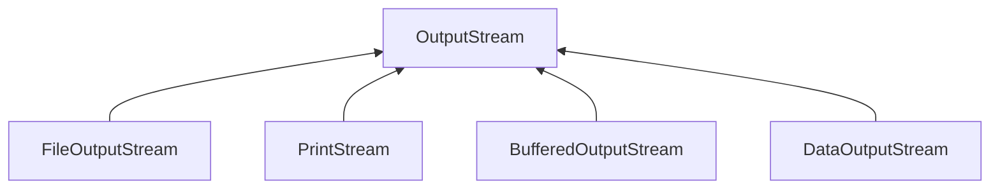
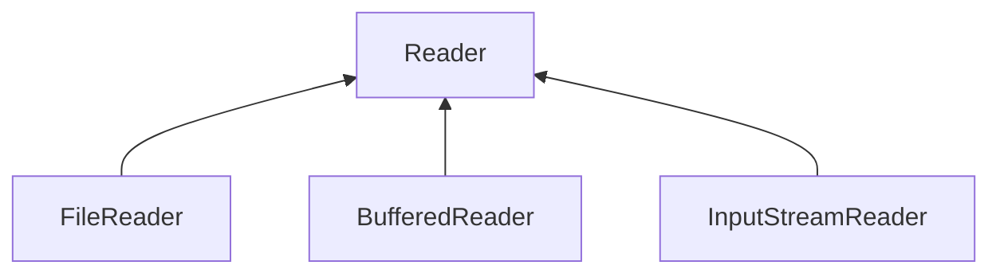
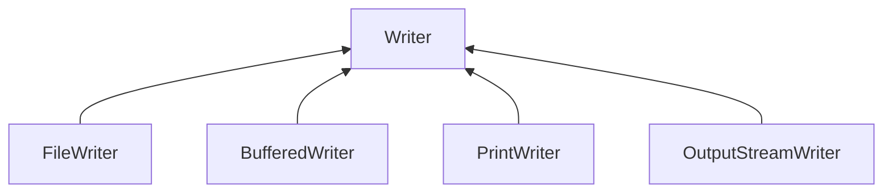

# Chapter 18. IO 기반 입출력 및 네트워킹

# 18.1. IO 패키지 소개

자바에서 데이터는 스트림(Stream)을 통해 입출력되므로 스트림의 특징을 잘 이해해야 한다.


# 18.2. 입력 스트림과 출력 스트림

* **입력 스트림 (InputStream)** : 프로그램이 데이터를 입력받을 때
  * ex) 키보드, 파일, 프로그램
* **출력 스트림 (OutputStream)** : 프로그램이 데이터를 보낼 때
  * ex) 모니터, 파일, 프로그램


자바의 기본적인 데이터 입출력 (IO: Input/Output) API 는 java.io 패키지에서 제공하고 있다.

* **java.io 패키지의 주요 클래스들**

  

* **스트림 클래스 두 종류**
  * 바이트(Byte) 기반 스트림
    * 모든 종류의 데이터
  * 문자(Character) 기반 스트림

* **바이트 기반 스트림과 문자 기반 스트림의 최상위 클래스**

  

* **스트림 입출력 흐름**

  

  > 그림, 멀티미디어, 텍스트 등의 파일을 바이트 단위로 읽어들일 때에는 FileInputStream을 사용하고, 바이트 단위로 저장할 때에는 FileOutputStream을 사용한다.
  >
  > 텍스트 파일의 경우, 문자 단위로 읽어들일 때에는 FileReader를 사용하고, 문자 단위로 저장할 때에는 FileWriter를 사용한다.


## 18.2.1. InputStream

InputStream은 바이트 기반 입력 스트림의 최상위 클래스로 추상 클래스이다. 


* **InputStream 클래스의 주요 메소드들**

  | 리턴타입 | 메소드                            | 설명                                                         |
  | -------- | --------------------------------- | ------------------------------------------------------------ |
  | int      | read()                            | 입력 스트림으로부터 1 바이트를 읽고 읽은 바이트를 리턴한다.  |
  | int      | read(byte[ ] b)                   | 입력 스트림으로부터 읽은 바이트들을 매개값으로<br /> 주어진 바이트 배열 b에 저장하고 실제로 읽은 바이트 수를 리턴한다. |
  | int      | read(byte[ ] b, int off, int len) | 입력 스트림으로부터 len 개의 바이트 만큼 읽고 매개값으로 주어진 바이트 배열 b[off] 부터 len 개 까지 저장한다.<br />그리고 실제로 읽은 바이트 수인 len 개를 리턴한다. <br />만약 len 개를 모두 읽지 못하면 실제로 읽은 바이트 수를 리턴한다. |
  | void     | close()                           | 사용한 시스템 자원을 반납하고 입력 스트림을 닫는다.          |


### read() 메소드

1바이트 씩 읽고 그 바이트 리턴

```java
package input_stream;

import java.io.*;

public class Read {

    public static void main(String[] args) throws IOException {

        String current = new java.io.File(".").getCanonicalPath();

        InputStream is = new FileInputStream(current + "/test.txt");
        int readByte;

        // read() 메소드
        while ((readByte=is.read()) != -1) {
            System.out.print(readByte + " ");
        }
        System.out.println();
    }
}
```

**실행결과**

```
49 50 51 52 10 49 50 51 52 10 49 50 51 52 10
```


### read(byte[ ] b) 메소드

읽은 바이트를 매개변수인 바이트 배열에 저장하고 파일의 마지막에 도달하면 전체 바이트 수를 리턴한다.

```java
package input_stream;

import java.io.FileInputStream;
import java.io.IOException;
import java.io.InputStream;

public class ReadBytes {

    public static void main(String[] args) throws IOException {

        String current = new java.io.File(".").getCanonicalPath();

        InputStream is = new FileInputStream(current + "/test.txt");

        // read(byte[] b) 메소드
        byte[] readBytes = new byte[100];
        int readByteNo;
        while ((readByteNo=is.read(readBytes)) != -1) {
            System.out.print(readByteNo + " ");
        }
        System.out.println();

        for(int i=0; i < 15; i++) {
            System.out.print(readBytes[i] + " ");
        }
    }
}
```

**실행결과**

```
15 
49 50 51 52 10 49 50 51 52 10 49 50 51 52 10
```


### read(byte[ ] b, int off, int len)

len개의 바이트만큼 읽고, 읽은 바이트를 매개변수인 바이트 배열에 저장하고 파일의 마지막에 도달하면 전체 바이트 수를 리턴한다.

```java
package input_stream;

import java.io.FileInputStream;
import java.io.IOException;
import java.io.InputStream;

public class ReadBytesOffLen {

    public static void main(String[] args) throws IOException {
        String current = new java.io.File(".").getCanonicalPath();

        InputStream is = new FileInputStream(current + "/test.txt");

        byte[] readBytes = new byte[100];
        int readByteNo;
        while((readByteNo = is.read(readBytes, 0, 100)) != -1) {
            System.out.print(readByteNo + " ");
        }

        System.out.println();

        for(int i=0; i < 15; i++) {
            System.out.print(readBytes[i] + " ");
        }
    }
}
```

**실행결과**

```
15 
49 50 51 52 10 49 50 51 52 10 49 50 51 52 10
```


### close() 메소드

더 이상 InputStream을 사용하지 않을 때 시스템 자원을 풀어준다.

```java
is.close();
```


## 18.2.2. OutputStream

OutputStream은 **바이트 기반 출력 스트림** 의 최상위 클래스로 추상 클래스이다.




* **OutputStream 클래스 주요 메소드들**

  | 리턴 타입 | 메소드                             | 설명                                                         |
  | --------- | ---------------------------------- | ------------------------------------------------------------ |
  | void      | write(int b)                       | 출력 스트림으로 1 바이트를 보낸다.                           |
  | void      | write(byte[ ] b)                   | 출력 스트림으로 주어진 바이트 배열 b의 모든 바이트를 보낸다. |
  | void      | write(byte[ ] b, int off, int len) | 출력 스트림으로 주어진 바이트 배열 b[off]부터 len개 까지의 바이트를 보낸다. |
  | void      | flush()                            | 버퍼에 잔류하는 모든 바이트를 출력한다.                      |
  | void      | close()                            | 사용한 시스템 자원을 반납하고 출력 스트림을 닫는다.          |


### write(int b) 메소드

1 바이트 씩 파일에 출력시킨다.

```java
package output_stream;

import java.io.*;

public class Write {
    public static void main(String[] args) throws IOException {
        String current = new java.io.File(".").getCanonicalPath();
        OutputStream os = new FileOutputStream(current + "/test_write.txt");

        byte[] data = "ABC".getBytes();

        for (int i=0; i<data.length; i++) {
            os.write(data[i]);  // A, B, C 를 하나씩 출력
        }
    }
}
```


### write(byte[] b) 메소드

바이트 배열의 모든 바이트를 파일에 출력시킨다.

```java
package output_stream;

import java.io.File;
import java.io.FileOutputStream;
import java.io.IOException;
import java.io.OutputStream;

public class WriteBytes {
    public static void main(String[] args) throws IOException {
        String current = new java.io.File(".").getCanonicalPath();
        OutputStream os = new FileOutputStream(current + "/test_write.txt");

        byte[] data = "ABC".getBytes();
        os.write(data);		// 바이트 전체 출력
    }
}
```


### write(byte[] b, int off, int lne) 메소드

b[off] 부터 len 개의 바이트를 파일에 출력시킨다.

```java
package output_stream;

import java.io.FileOutputStream;
import java.io.IOException;
import java.io.OutputStream;

public class WriteBytesOffLength {
    public static void main(String[] args) throws IOException {
        String current = new java.io.File(".").getCanonicalPath();
        OutputStream os = new FileOutputStream(current + "/test_write.txt");

        byte[] data = "ABC".getBytes();
        os.write(data, 1, 2);	// 1 번째 부터 2 번째 까지 바이트 출력
    }
}
```


### flush() 와 close() 메소드

* **flush()** : 버퍼에 잔류하고 있는 버퍼들을 비워주는 역할.
* **close()** : OutputStream을 더 이상 사용하지 않을 경우에 사용.

```java
package output_stream;

import java.io.FileNotFoundException;
import java.io.FileOutputStream;
import java.io.IOException;
import java.io.OutputStream;

public class FlushClose {
    public static void main(String[] args) throws IOException {
        String current = new java.io.File(".").getCanonicalPath();
        OutputStream os = new FileOutputStream(current + "/test_write.txt");

        byte[] data = "ABC".getBytes();
        os.write(data, 1, 2);
        os.flush();     // 버퍼를 비운다.
        os.close();     // OutputStream을 종료한다.
    }
}
```


## 18.2.3. Reader

Reader는 **문자 기반 입력 스트림** 의 최상위 클래스로 추상 클래스이다.




* **Reader 주요 메소드들**

  | 리턴 타입 | 메소드                                | 설명                                                         |
  | --------- | ------------------------------------- | ------------------------------------------------------------ |
  | int       | read( )                               | 입력 스트림으로부터 한 개의 문자를 읽고 리턴.                |
  | int       | read(char[ ] cbuf)                    | 입력 스트림으로부터 읽은 문자들을 매개값으로 주어진 문자 배열 cbuf에 저장하고 실제로 읽은 문자 수를 리턴한다. |
  | int       | read(char[ ] chuff, int off, int len) | len 개의 문자를 읽고 off 부터 len 개까지 저장.               |
  | void      | close( )                              | 시스템 자원 반납 후 입력 스트림 닫음.                        |


### read() 메소드

한 개의 문자(2바이트) 를 읽고 4 바이트 int 타입으로 리턴한다.

```java
package reader;

import java.io.File;
import java.io.FileReader;
import java.io.IOException;
import java.io.Reader;

public class Read {
    public static void main(String[] args) throws IOException {
        String current = new java.io.File(".").getCanonicalPath();
        Reader reader = new FileReader(current + "/test_reader.txt");

        int readData;

        while ((readData = reader.read()) != -1) {	// 한 글자를 읽어와서 저장한다.
            char charData = (char) readData;				// int 타입의 글자를 char 로 변환
            System.out.print(charData + " ");
        }
    }
}
```


### read(char[] cbuf) 메소드

주어진 문자 배열의 길이만큼 문자를 읽고 배열에 저장한다. 그리고 읽은 문자 수를 리턴.

```java
package reader;

import java.io.FileReader;
import java.io.IOException;
import java.io.Reader;

public class ReadCbuf {
    public static void main(String[] args) throws IOException {
        String current = new java.io.File(".").getCanonicalPath();
        Reader reader = new FileReader(current + "/test_reader.txt");

        int readCharNo;
        char[] cbuf = new char[2];

        while ((readCharNo = reader.read(cbuf)) != -1) {
         		// 주어진 배열 2개 만큼 글자를 읽은 후 저장한다.
         		// 그리고 readCharNo 에 읽은 글자 수를 저장한다.
            System.out.print(readCharNo + " " + cbuf[0] + " " + cbuf[1] + "\n");
        }
    }
}
```


### read(char[] cbuf, int off, int len) 메소드

len 개의 문자만큼 읽고 주어진 문자 배열 cbuf[off] 부터 len개까지 저장한다.

```java
package reader;

import java.io.FileReader;
import java.io.IOException;
import java.io.Reader;

public class ReadCbufOffLen {
    public static void main(String[] args) throws IOException {
        String current = new java.io.File(".").getCanonicalPath();
        Reader reader = new FileReader(current + "/test_reader.txt");

        char[] cbuf = new char[100];

        int readCharNo = reader.read(cbuf, 0, 100);	// 0 ~ 100 까지 문자 읽어옴.
        System.out.println(readCharNo);
        
        for (int i=0; i<cbuf.length; i++) {
            if (cbuf[i] != 0)
                System.out.println(cbuf[i]);
        }
    }
}
```


### close() 메소드

Reader를 더 이상 사용하지 않을 경우 호출

```java
reader.close();
```


## 18.2.4. Writer

**문자 기반 출력 스트림의** 최상위 클래스로 추상 클래스이다.




* **Writer 클래스 주요 메소드들**

  | 리턴 타입 | 메소드                                | 설명                                        |
  | --------- | ------------------------------------- | ------------------------------------------- |
  | void      | write(int c)                          | 한 문자를 보낸다.                           |
  | void      | write(char[ ] cbuf)                   | 주어진 문자 배열 cbuf의 모든 문자를 보낸다. |
  | void      | write(char[ ] cbuf, int off, int len) | cbuf[off] 부터 len개 까지의 문자를 보낸다.  |
  | void      | write(String str)                     | 주어진 문자열을 전부 보낸다.                |
  | void      | write(String str, int off, int len)   | 문자열 off 부터 len 개 까지의 문자를 보낸다 |
  | void      | flush()                               | 버퍼에 잔류하는 모든 문자 출력              |
  | void      | close()                               | 출력 스트림을 닫는다.                       |


### write(int c) 메소드

한 문자를 출력시킨다.

```java
package writer;

import java.io.FileWriter;
import java.io.IOException;
import java.io.Writer;

public class Write {
    public static void main(String[] args) throws IOException {
        String current = new java.io.File(".").getCanonicalPath();
        Writer writer = new FileWriter(current + "/writer.txt", true);

        char[] data = "홍길동".toCharArray();

        for (int i=0; i<data.length; i++) {
            writer.write(data[i]);      // 홍, 길, 동 하나씩 출력
        }

        writer.close(); // 반드시 닫아 주어야한다.
    }
}
```


### write(char[ ] cbuf) 메소드

char[] 배열의 모든 문자를 출력

```java
package writer;

import java.io.FileWriter;
import java.io.IOException;
import java.io.Writer;

public class WriterCbuf {
    public static void main(String[] args) throws IOException {
        String current = new java.io.File(".").getCanonicalPath();
        Writer writer = new FileWriter(current + "/test_writer.txt");

        char[] data = "홍길동".toCharArray();

        // 배열 전체 출력
        writer.write(data);
        writer.close();
    }
}
```


### write(char[ ] c, int off, int len) 메소드

c[off] 부터 len 개의 문자를 출력

```java
package writer;

import java.io.FileWriter;
import java.io.IOException;
import java.io.Writer;

public class WriterOffLen {
    public static void main(String[] args) throws IOException {
        String current = new java.io.File(".").getCanonicalPath();
        Writer writer = new FileWriter(current + "/writer.txt", true);

        char[] data = "홍길동".toCharArray();
        
        // 글자 배열의 1부터 2까지 출력
        writer.write(data, 1, 2);
        writer.close();
    }
}
```


### write(String str) 와 write(String str, int off, int lne) 메소드

문자열을 좀 더 쉽게 출력한다.

```java
package writer;

import java.io.FileWriter;
import java.io.IOException;
import java.io.Writer;

public class WriterString {
    public static void main(String[] args) throws IOException {
        String current = new java.io.File(".").getCanonicalPath();
        Writer writer = new FileWriter(current + "/writer.txt");

        String data = "안녕 자바 프로그램";

        // 문자열 출력
        writer.write(data);

        // 문자열 3부터 4번 까지 출력
        writer.write(data, 3, 4);

        writer.flush();
        writer.close();
    }
}
```


# 18.3. 콘솔 입출력

* **콘솔(Console)** : 시스템을 사용하기 위해 키보드로 입력을 받고 화면으로 출력하는 소프트웨어이다.
  * 데이터를 입력받을 때 : System.in
  * 데이터를 출력할 때 : System.out
  * 에러를 출력할 때 : System.err


## 18.3.1. System.in 필드

* System.in 은 InputStream 타입의 필드이므로 InputStream 변수로 참조가 가능하다.

  ```java
  InputStream is = System.in;
  ```

* 키보드로부터 어떤 키가 입력되었는지 확인하려면 InputStream의 read() 메소드로 한 바이트를 읽으면 된다.

  ```java
  int asciiCode = is.read();					// 키 읽기
  char inputChar = (char) is.read();	// 키 변환
  ```

* **예제) 콘솔에서 입력한 번호 알아내기**

  ```java
  package system;
  
  import java.io.IOException;
  import java.io.InputStream;
  
  public class SystemInExample1 {
      public static void main(String[] args) throws IOException {
          System.out.println("== 메뉴 ==");
          System.out.println("1. 예금 조회");
          System.out.println("2. 예금 출금");
          System.out.println("3. 예금 입금");
          System.out.println("4. 종료 하기");
          System.out.print("메뉴를 선택하세요: ");
          
          // 키보드 입력 스트림 얻기
          InputStream is = System.in;
          
          // 아스키 코드를 읽고 문자로 리턴
          char inputChar = (char) is.read();
  
          switch (inputChar) {
              case '1':
                  System.out.println("예금 조회를 선택하셨습니다.");
                  break;
              case '2':
                  System.out.println("예금 출금을 선택하셨습니다.");
                  break;
              case '3':
                  System.out.println("예금 입금을 선택하셨습니다.");
                  break;
              case '4':
                  System.out.println("종료 하기를 선택하셨습니다.");
                  break;
          }
      }
  }
  ```

  **실행 결과**

  ```
  == 메뉴 ==
  1. 예금 조회
  2. 예금 출금
  3. 예금 입금
  4. 종료 하기
  메뉴를 선택하세요: 4
  종료 하기를 선택하셨습니다.
  ```

  > InputStream 의 **read() 메소드는 1바이트만** 읽을 수 있다. 그렇기 때문에 한글을 얻기 위해서는 우선 **read(byte[ ] b) 나 read(byte[ ] b, int off, int len)** 메소드로 바이트 배열을 받고, 이 배열을 이용해서 String 객체를 생성하면 된다.

  ```java
  byte[] byteData = new byte[15];
  int readByteNo = System.in.read(byteData);
  
  // (바이트수 - 2) 를 하는 이유는 Enter키에 해당하는 마지막 두 바이트를 제외하기 위해서이다.
  String strData = new String(byteData, 0, readByteNo-1);
  ```


* **예제) 콘솔에서 입력한 한글 알아내기**

  ```java
  package system;
  
  import java.io.IOException;
  import java.io.InputStream;
  
  public class SystemInExample2 {
      public static void main(String[] args) throws IOException {
          InputStream is = System.in;
  
          byte[] datas = new byte[100];
  
          System.out.println("이름: ");
          int nameBytes = is.read(datas);
          String name = new String(datas, 0, nameBytes-1);
  
          System.out.println("하고 싶은 말: ");
          int commentBytes = is.read(datas);
          String comment = new String(datas, 0, commentBytes-1);
  
          System.out.println("입력한 이름: " + name);
          System.out.println("입력한 하고 싶은말: " + comment);
      }
  }
  ```

  **실행 결과**

  ```
  이름: 
  이상민
  하고 싶은 말: 
  가
  입력한 이름: 이상민
  입력한 하고 싶은말: 가
  ```


## 18.3.2. System.out 필드

* 콘솔로 데이터를 출력하기 위해서는 System 클래스의 out 정적 필드를 사용한다.

* out은 PrintStream 타입의 필드이다.

* OutputStream 의 write(int b) 메소드를 이용.

  ```java
  byte b = 97;
  os.write(b);	// 'a' 출력
  os.flush();
  ```

* 한글을 출력하기 위해서는 우선 한글을 바이트 배열로 얻은 다음, write(byte[ ] b) 나 write(byte[ ] b, int off, int lne) 메소드를 통해 출력한다.

  ```java
  String name = "홍길동";
  byte[] nameBytes = name.getBytes();
  os.write(nameBytes);
  os.flush();
  ```

* **예제) 연속된 숫자, 영어, 한글 출력**

  ```java
  package system;
  
  import java.io.IOException;
  import java.io.OutputStream;
  
  public class SystemOutExample {
      public static void main(String[] args) throws IOException {
          OutputStream os = System.out;
  
          for (byte b = 48; b < 58; b++) {
              // 아스키 코드 48 ~ 57 문자 출력
              os.write(b);
          }
          // 라인피드(10)을 출력하면 다음 행으로 넘어간다.
          os.write(10);
  
          for (byte b = 97; b < 123; b++) {
              os.write(b);
          }
          os.write(10);
  
          String hangul = "가나다라마바사아자차카타파하";
          byte[] hangulBytes = hangul.getBytes();
          os.write(hangulBytes);
  
          os.flush();
      }
  }
  ```

  **실행 결과**

  ```
  0123456789
  abcdefghijklmnopqrstuvwxyz
  가나다라마바사아자차카타파하
  ```


## 18.3.3. Console 클래스

콘솔에서 입력받은 문자열을 쉽게 읽을 수 있도록 java.io.Console 클래스를 제공하고 있다.

```java
Console console = System.console();
```

* **주의할 점**

  이클립스에서 실행하면 System.console() 메소드는 null을 리턴하기 때문에 **반드시 명령 프롬프트에서 실행해야 한다.**

* **Console 읽기 메소드들**

  | 리턴 타입 | 메소드          | 설명                                                  |
  | --------- | --------------- | ----------------------------------------------------- |
  | String    | readLine()      | Enter키를 입력하기 전의 모든 문자열을 읽음            |
  | char[ ]   | readPassword( ) | 키보드 입력 문자를 콘솔에 보여주지 않고 문자열을 읽음 |

* **ex) 아이디와 패스워드를 콘솔로부터 읽음**

  ```java
  package console;
  
  import java.io.Console;
  
  public class ConsoleExample {
      public static void main(String[] args) {
          Console console = System.console();
  
          System.out.print("아이디: ");
          String id = console.readLine();
  
          System.out.print("패스워드: ");
          char[] charPass = console.readPassword();
          String strPassword = new String(charPass);
  
          System.out.println("------------------");
          System.out.println(id);
          System.out.println(strPassword);
      }
  }
  ```


## 18.3.4. Scanner 클래스

Console 클래스는 콘솔로부터 문자열은 읽을 수 있지만 기본 타입(정수, 실수) 값을 바로 읽을 수는 없다. 하지만 Scanner 클래스를 이용하면 기본 타입 값을 가져올 수 있다.

```java
Scanner scanner = new Scanner(System.in);
```


* **Scanner 메소드들**

  | 리턴 타입 | 메소드        | 설명                             |
  | --------- | ------------- | -------------------------------- |
  | boolean   | nextBoolean() | boolean(true/false) 값을 읽는다. |
  | byte      | nextByte()    | Byte 값을 읽는다.                |
  | short     | nextShort()   | Short 값을 읽는다.               |
  | int       | nextInt()     | int 값을 읽는다.                 |
  | long      | nextLong()    | long 값을 읽는다.                |
  | float     | nextFloat()   | float 값을 읽는다.               |
  | double    | nextDouble()  | double 값을 읽는다.              |
  | String    | nextLine()    | String 값을 읽는다.              |

* **예제) 문자열, 정수, 실수를 직접 읽는 예제**

  ```java
  package scanner;
  
  import java.util.Scanner;
  
  public class ScannerExample {
      public static void main(String[] args) {
        // 콘솔 생성
          Scanner scanner = new Scanner(System.in);
  
          System.out.print("문자열 입력> ");
          String inputString = scanner.nextLine();
          System.out.println(inputString);
          System.out.println();
  
          System.out.print("정수 입력> ");
          int inputInt = scanner.nextInt();
          System.out.println(inputInt);
          System.out.println();
  
          System.out.println("실수 입력> ");
          double inputDouble = scanner.nextDouble();
          System.out.println(inputDouble);
      }
  }
  ```

  **실행 결과**

  ```
  문자열 입력> 안녕하세요
  안녕하세요
  
  정수 입력> 12
  12
  
  실수 입력> 
  1.222
  1.222
  ```


# 18.4. 파일 입출력

## 18.4.1. File 클래스

IO 패키지에서 제공하는 File 클래스는 파일 크기, 파일 속성, 파일 이름 등의 정보를 얻어내는 기능과 파일 생성 및 삭제 기능을 제공하고 있다. 그리고 디렉토리를 생성하고 디렉토리에 존재하는 파일 리스트를 얻어내는 기능도 있다.

* **파일 생성 예시**

  ```java
  File file = new File("C:\\Temp\\file.txt");
  File file = new File("C:/Temp/file.txt");
  ```

  > File 객체를 생성했다고 해서 파일이나 디렉토리가 생성되는 것은 아니다.

* **파일 존재 확인 예시**

  ```java
  boolean isExist = file.exists();
  ```

* **파일 및 디렉토리 생성/제거 메소드들**

  | 리턴 타입 | 메소드          | 설명                               |
  | --------- | --------------- | ---------------------------------- |
  | boolean   | createNewFile() | 새로운 파일을 생성                 |
  | boolean   | mkdir()         | 새로운 디렉토리를 생성             |
  | boolean   | mkdirs()        | 경로상에 없는 모든 디렉토리를 생성 |
  | boolean   | delete()        | 파일 또는 디렉토리 삭제            |

  