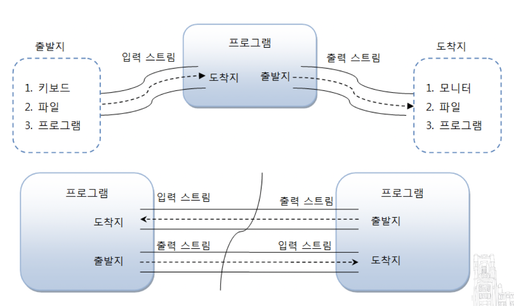

# Chapter 18. IO 기반 입출력 및 네트워킹

# 18.1. IO 패키지 소개

자바에서 데이터는 스트림(Stream)을 통해 입출력되므로 스트림의 특징을 잘 이해해야 한다.


# 18.2. 입력 스트림과 출력 스트림

* **입력 스트림 (InputStream)** : 프로그램이 데이터를 입력받을 때
  * ex) 키보드, 파일, 프로그램
* **출력 스트림 (OutputStream)** : 프로그램이 데이터를 보낼 때
  * ex) 모니터, 파일, 프로그램




자바의 기본적인 데이터 입출력 (IO: Input/Output) API 는 java.io 패키지에서 제공하고 있다.

* **java.io 패키지의 주요 클래스들**

  

* **스트림 클래스 두 종류**
  * 바이트(Byte) 기반 스트림
    * 모든 종류의 데이터
  * 문자(Character) 기반 스트림

* **바이트 기반 스트림과 문자 기반 스트림의 최상위 클래스**

  

* **스트림 입출력 흐름**

  

  > 그림, 멀티미디어, 텍스트 등의 파일을 바이트 단위로 읽어들일 때에는 FileInputStream을 사용하고, 바이트 단위로 저장할 때에는 FileOutputStream을 사용한다.
  >
  > 텍스트 파일의 경우, 문자 단위로 읽어들일 때에는 FileReader를 사용하고, 문자 단위로 저장할 때에는 FileWriter를 사용한다.


## 18.2.1. InputStream

InputStream은 바이트 기반 입력 스트림의 최상위 클래스로 추상 클래스이다. 


* **InputStream 클래스의 주요 메소드들**

  | 리턴타입 | 메소드                            | 설명                                                         |
  | -------- | --------------------------------- | ------------------------------------------------------------ |
  | int      | read()                            | 입력 스트림으로부터 1 바이트를 읽고 읽은 바이트를 리턴한다.  |
  | int      | read(byte[ ] b)                   | 입력 스트림으로부터 읽은 바이트들을 매개값으로<br /> 주어진 바이트 배열 b에 저장하고 실제로 읽은 바이트 수를 리턴한다. |
  | int      | read(byte[ ] b, int off, int len) | 입력 스트림으로부터 len 개의 바이트 만큼 읽고 매개값으로 주어진 바이트 배열 b[off] 부터 len 개 까지 저장한다.<br />그리고 실제로 읽은 바이트 수인 len 개를 리턴한다. <br />만약 len 개를 모두 읽지 못하면 실제로 읽은 바이트 수를 리턴한다. |
  | void     | close()                           | 사용한 시스템 자원을 반납하고 입력 스트림을 닫는다.          |


### read() 메소드

1바이트 씩 읽고 그 바이트 리턴

```java
package input_stream;

import java.io.*;

public class Read {

    public static void main(String[] args) throws IOException {

        String current = new java.io.File(".").getCanonicalPath();

        InputStream is = new FileInputStream(current + "/test.txt");
        int readByte;

        // read() 메소드
        while ((readByte=is.read()) != -1) {
            System.out.print(readByte + " ");
        }
        System.out.println();
    }
}
```

**실행결과**

```
49 50 51 52 10 49 50 51 52 10 49 50 51 52 10
```


### read(byte[ ] b) 메소드

읽은 바이트를 매개변수인 바이트 배열에 저장하고 파일의 마지막에 도달하면 전체 바이트 수를 리턴한다.

```java
package input_stream;

import java.io.FileInputStream;
import java.io.IOException;
import java.io.InputStream;

public class ReadBytes {

    public static void main(String[] args) throws IOException {

        String current = new java.io.File(".").getCanonicalPath();

        InputStream is = new FileInputStream(current + "/test.txt");

        // read(byte[] b) 메소드
        byte[] readBytes = new byte[100];
        int readByteNo;
        while ((readByteNo=is.read(readBytes)) != -1) {
            System.out.print(readByteNo + " ");
        }
        System.out.println();

        for(int i=0; i < 15; i++) {
            System.out.print(readBytes[i] + " ");
        }
    }
}
```

**실행결과**

```
15 
49 50 51 52 10 49 50 51 52 10 49 50 51 52 10
```


### read(byte[ ] b, int off, int len)

len개의 바이트만큼 읽고, 읽은 바이트를 매개변수인 바이트 배열에 저장하고 파일의 마지막에 도달하면 전체 바이트 수를 리턴한다.

```java
package input_stream;

import java.io.FileInputStream;
import java.io.IOException;
import java.io.InputStream;

public class ReadBytesOffLen {

    public static void main(String[] args) throws IOException {
        String current = new java.io.File(".").getCanonicalPath();

        InputStream is = new FileInputStream(current + "/test.txt");

        byte[] readBytes = new byte[100];
        int readByteNo;
        while((readByteNo = is.read(readBytes, 0, 100)) != -1) {
            System.out.print(readByteNo + " ");
        }

        System.out.println();

        for(int i=0; i < 15; i++) {
            System.out.print(readBytes[i] + " ");
        }
    }
}
```

**실행결과**

```
15 
49 50 51 52 10 49 50 51 52 10 49 50 51 52 10
```


### close() 메소드

더 이상 InputStream을 사용하지 않을 때 시스템 자원을 풀어준다.

```java
is.close();
```


## 18.2.2. OutputStream

OutputStream은 **바이트 기반 출력 스트림** 의 최상위 클래스로 추상 클래스이다.


* **OutputStream 클래스 주요 메소드들**

  | 리턴 타입 | 메소드                             | 설명                                                         |
  | --------- | ---------------------------------- | ------------------------------------------------------------ |
  | void      | write(int b)                       | 출력 스트림으로 1 바이트를 보낸다.                           |
  | void      | write(byte[ ] b)                   | 출력 스트림으로 주어진 바이트 배열 b의 모든 바이트를 보낸다. |
  | void      | write(byte[ ] b, int off, int len) | 출력 스트림으로 주어진 바이트 배열 b[off]부터 len개 까지의 바이트를 보낸다. |
  | void      | flush()                            | 버퍼에 잔류하는 모든 바이트를 출력한다.                      |
  | void      | close()                            | 사용한 시스템 자원을 반납하고 출력 스트림을 닫는다.          |


### write(int b) 메소드

1 바이트 씩 파일에 출력시킨다.

```java
package output_stream;

import java.io.*;

public class Write {
    public static void main(String[] args) throws IOException {
        String current = new java.io.File(".").getCanonicalPath();
        OutputStream os = new FileOutputStream(current + "/test_write.txt");

        byte[] data = "ABC".getBytes();

        for (int i=0; i<data.length; i++) {
            os.write(data[i]);  // A, B, C 를 하나씩 출력
        }
    }
}
```


### write(byte[] b) 메소드

바이트 배열의 모든 바이트를 파일에 출력시킨다.

```java
package output_stream;

import java.io.File;
import java.io.FileOutputStream;
import java.io.IOException;
import java.io.OutputStream;

public class WriteBytes {
    public static void main(String[] args) throws IOException {
        String current = new java.io.File(".").getCanonicalPath();
        OutputStream os = new FileOutputStream(current + "/test_write.txt");

        byte[] data = "ABC".getBytes();
        os.write(data);		// 바이트 전체 출력
    }
}
```


### write(byte[] b, int off, int lne) 메소드

b[off] 부터 len 개의 바이트를 파일에 출력시킨다.

```java
package output_stream;

import java.io.FileOutputStream;
import java.io.IOException;
import java.io.OutputStream;

public class WriteBytesOffLength {
    public static void main(String[] args) throws IOException {
        String current = new java.io.File(".").getCanonicalPath();
        OutputStream os = new FileOutputStream(current + "/test_write.txt");

        byte[] data = "ABC".getBytes();
        os.write(data, 1, 2);	// 1 번째 부터 2 번째 까지 바이트 출력
    }
}
```


### flush() 와 close() 메소드

* **flush()** : 버퍼에 잔류하고 있는 버퍼들을 비워주는 역할.
* **close()** : OutputStream을 더 이상 사용하지 않을 경우에 사용.

```java
package output_stream;

import java.io.FileNotFoundException;
import java.io.FileOutputStream;
import java.io.IOException;
import java.io.OutputStream;

public class FlushClose {
    public static void main(String[] args) throws IOException {
        String current = new java.io.File(".").getCanonicalPath();
        OutputStream os = new FileOutputStream(current + "/test_write.txt");

        byte[] data = "ABC".getBytes();
        os.write(data, 1, 2);
        os.flush();     // 버퍼를 비운다.
        os.close();     // OutputStream을 종료한다.
    }
}
```


## 18.2.3. Reader

Reader는 **문자 기반 입력 스트림** 의 최상위 클래스로 추상 클래스이다.


* **Reader 주요 메소드들**

  | 리턴 타입 | 메소드                                | 설명                                                         |
  | --------- | ------------------------------------- | ------------------------------------------------------------ |
  | int       | read( )                               | 입력 스트림으로부터 한 개의 문자를 읽고 리턴.                |
  | int       | read(char[ ] cbuf)                    | 입력 스트림으로부터 읽은 문자들을 매개값으로 주어진 문자 배열 cbuf에 저장하고 실제로 읽은 문자 수를 리턴한다. |
  | int       | read(char[ ] chuff, int off, int len) | len 개의 문자를 읽고 off 부터 len 개까지 저장.               |
  | void      | close( )                              | 시스템 자원 반납 후 입력 스트림 닫음.                        |


### read() 메소드

한 개의 문자(2바이트) 를 읽고 4 바이트 int 타입으로 리턴한다.

```java
package reader;

import java.io.File;
import java.io.FileReader;
import java.io.IOException;
import java.io.Reader;

public class Read {
    public static void main(String[] args) throws IOException {
        String current = new java.io.File(".").getCanonicalPath();
        Reader reader = new FileReader(current + "/test_reader.txt");

        int readData;

        while ((readData = reader.read()) != -1) {	// 한 글자를 읽어와서 저장한다.
            char charData = (char) readData;				// int 타입의 글자를 char 로 변환
            System.out.print(charData + " ");
        }
    }
}
```


### read(char[] cbuf) 메소드

주어진 문자 배열의 길이만큼 문자를 읽고 배열에 저장한다. 그리고 읽은 문자 수를 리턴.

```java
package reader;

import java.io.FileReader;
import java.io.IOException;
import java.io.Reader;

public class ReadCbuf {
    public static void main(String[] args) throws IOException {
        String current = new java.io.File(".").getCanonicalPath();
        Reader reader = new FileReader(current + "/test_reader.txt");

        int readCharNo;
        char[] cbuf = new char[2];

        while ((readCharNo = reader.read(cbuf)) != -1) {
         		// 주어진 배열 2개 만큼 글자를 읽은 후 저장한다.
         		// 그리고 readCharNo 에 읽은 글자 수를 저장한다.
            System.out.print(readCharNo + " " + cbuf[0] + " " + cbuf[1] + "\n");
        }
    }
}
```


### read(char[] cbuf, int off, int len) 메소드

len 개의 문자만큼 읽고 주어진 문자 배열 cbuf[off] 부터 len개까지 저장한다.

```java
package reader;

import java.io.FileReader;
import java.io.IOException;
import java.io.Reader;

public class ReadCbufOffLen {
    public static void main(String[] args) throws IOException {
        String current = new java.io.File(".").getCanonicalPath();
        Reader reader = new FileReader(current + "/test_reader.txt");

        char[] cbuf = new char[100];

        int readCharNo = reader.read(cbuf, 0, 100);	// 0 ~ 100 까지 문자 읽어옴.
        System.out.println(readCharNo);
        
        for (int i=0; i<cbuf.length; i++) {
            if (cbuf[i] != 0)
                System.out.println(cbuf[i]);
        }
    }
}
```


### close() 메소드

Reader를 더 이상 사용하지 않을 경우 호출

```java
reader.close();
```


## 18.2.4. Writer

**문자 기반 출력 스트림의** 최상위 클래스로 추상 클래스이다.


* **Writer 클래스 주요 메소드들**

  | 리턴 타입 | 메소드                                | 설명                                        |
  | --------- | ------------------------------------- | ------------------------------------------- |
  | void      | write(int c)                          | 한 문자를 보낸다.                           |
  | void      | write(char[ ] cbuf)                   | 주어진 문자 배열 cbuf의 모든 문자를 보낸다. |
  | void      | write(char[ ] cbuf, int off, int len) | cbuf[off] 부터 len개 까지의 문자를 보낸다.  |
  | void      | write(String str)                     | 주어진 문자열을 전부 보낸다.                |
  | void      | write(String str, int off, int len)   | 문자열 off 부터 len 개 까지의 문자를 보낸다 |
  | void      | flush()                               | 버퍼에 잔류하는 모든 문자 출력              |
  | void      | close()                               | 출력 스트림을 닫는다.                       |


### write(int c) 메소드

한 문자를 출력시킨다.

```java
package writer;

import java.io.FileWriter;
import java.io.IOException;
import java.io.Writer;

public class Write {
    public static void main(String[] args) throws IOException {
        String current = new java.io.File(".").getCanonicalPath();
        Writer writer = new FileWriter(current + "/writer.txt");

        char[] data = "홍길동".toCharArray();

        for (int i=0; i<data.length; i++) {
            writer.write(data[i]);      // 홍, 길, 동 하나씩 출력
        }
    }
}
```


### write(char[ ] cbuf) 메소드

char[] 배열의 모든 문자를 출력

```java

```


### write(char[ ] c, int off, int len)

c[off] 부터 len 개의 문자를 출력

