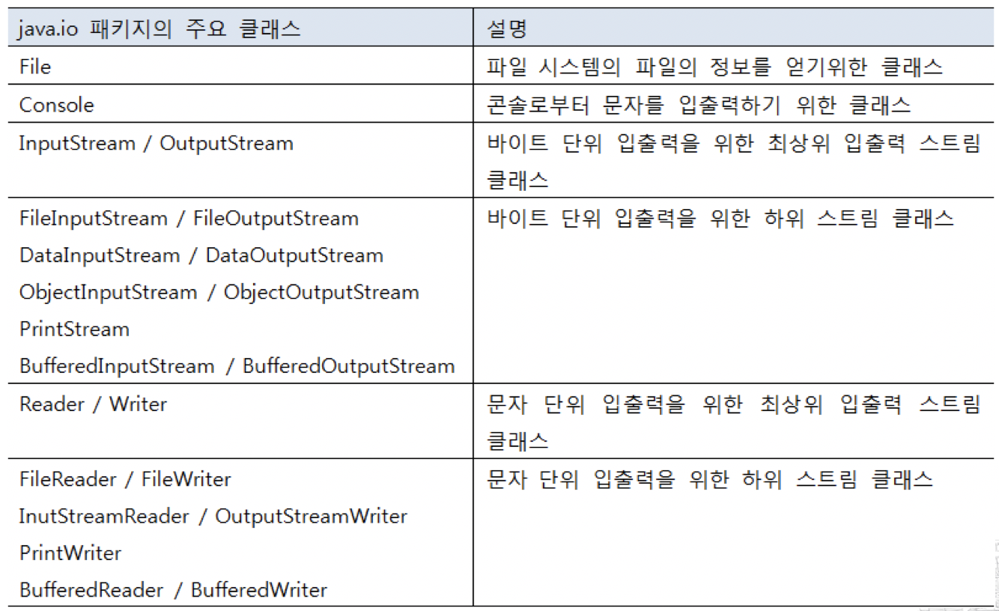
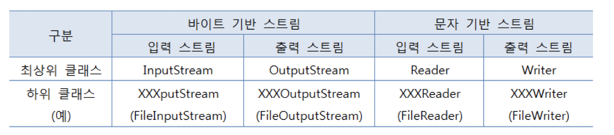
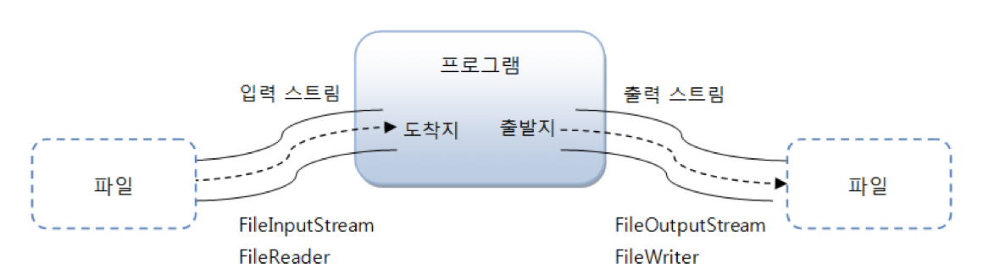
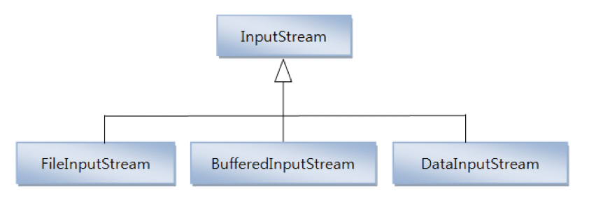

# Chapter 18. IO 기반 입출력 및 네트워킹

# 18.1. IO 패키지 소개

자바에서 데이터는 스트림(Stream)을 통해 입출력되므로 스트림의 특징을 잘 이해해야 한다.


# 18.2. 입력 스트림과 출력 스트림

* **입력 스트림 (InputStream)** : 프로그램이 데이터를 입력받을 때
  * ex) 키보드, 파일, 프로그램
* **출력 스트림 (OutputStream)** : 프로그램이 데이터를 보낼 때
  * ex) 모니터, 파일, 프로그램


자바의 기본적인 데이터 입출력 (IO: Input/Output) API 는 java.io 패키지에서 제공하고 있다.

* **java.io 패키지의 주요 클래스들**

  

* **스트림 클래스 두 종류**
  * 바이트(Byte) 기반 스트림
    * 모든 종류의 데이터
  * 문자(Character) 기반 스트림

* **바이트 기반 스트림과 문자 기반 스트림의 최상위 클래스**

  

* **스트림 입출력 흐름**

  

  > 그림, 멀티미디어, 텍스트 등의 파일을 바이트 단위로 읽어들일 때에는 FileInputStream을 사용하고, 바이트 단위로 저장할 때에는 FileOutputStream을 사용한다.
  >
  > 텍스트 파일의 경우, 문자 단위로 읽어들일 때에는 FileReader를 사용하고, 문자 단위로 저장할 때에는 FileWriter를 사용한다.


## 18.2.1. InputStream

InputStream은 바이트 기반 입력 스트림의 최상위 클래스로 추상 클래스이다. 



* **InputStream 클래스의 주요 메소드들**

  | 리턴타입 | 메소드                            | 설명                                                         |
  | -------- | --------------------------------- | ------------------------------------------------------------ |
  | int      | read()                            | 입력 스트림으로부터 1 바이트를 읽고 읽은 바이트를 리턴한다.  |
  | int      | read(byte[ ] b)                   | 입력 스트림으로부터 읽은 바이트들을 매개값으로<br /> 주어진 바이트 배열 b에 저장하고 실제로 읽은 바이트 수를 리턴한다. |
  | int      | read(byte[ ] b, int off, int len) | 입력 스트림으로부터 len 개의 바이트 만큼 읽고 매개값으로 주어진 바이트 배열 b[off] 부터 len 개 까지 저장한다.<br />그리고 실제로 읽은 바이트 수인 len 개를 리턴한다. <br />만약 len 개를 모두 읽지 못하면 실제로 읽은 바이트 수를 리턴한다. |
  | void     | close()                           | 사용한 시스템 자원을 반납하고 입력 스트림을 닫는다.          |


### read() 메소드

1바이트 씩 읽고 그 바이트 리턴

```java
package input_stream;

import java.io.*;

public class Read {

    public static void main(String[] args) throws IOException {

        String current = new java.io.File(".").getCanonicalPath();

        InputStream is = new FileInputStream(current + "/test.txt");
        int readByte;

        // read() 메소드
        while ((readByte=is.read()) != -1) {
            System.out.print(readByte + " ");
        }
        System.out.println();
    }
}
```

**실행결과**

```
49 50 51 52 10 49 50 51 52 10 49 50 51 52 10
```


### read(byte[ ] b) 메소드

읽은 바이트를 매개변수인 바이트 배열에 저장하고 파일의 마지막에 도달하면 전체 바이트 수를 리턴한다.

```java
package input_stream;

import java.io.FileInputStream;
import java.io.IOException;
import java.io.InputStream;

public class ReadBytes {

    public static void main(String[] args) throws IOException {

        String current = new java.io.File(".").getCanonicalPath();

        InputStream is = new FileInputStream(current + "/test.txt");

        // read(byte[] b) 메소드
        byte[] readBytes = new byte[100];
        int readByteNo;
        while ((readByteNo=is.read(readBytes)) != -1) {
            System.out.print(readByteNo + " ");
        }
        System.out.println();

        for(int i=0; i < 15; i++) {
            System.out.print(readBytes[i] + " ");
        }
    }
}
```

**실행결과**

```
15 
49 50 51 52 10 49 50 51 52 10 49 50 51 52 10
```


### read(byte[ ] b, int off, int len)

len개의 바이트만큼 읽고, 읽은 바이트를 매개변수인 바이트 배열에 저장하고 파일의 마지막에 도달하면 전체 바이트 수를 리턴한다.

```java
package input_stream;

import java.io.FileInputStream;
import java.io.IOException;
import java.io.InputStream;

public class ReadBytesOffLen {

    public static void main(String[] args) throws IOException {
        String current = new java.io.File(".").getCanonicalPath();

        InputStream is = new FileInputStream(current + "/test.txt");

        byte[] readBytes = new byte[100];
        int readByteNo;
        while((readByteNo = is.read(readBytes, 0, 100)) != -1) {
            System.out.print(readByteNo + " ");
        }

        System.out.println();

        for(int i=0; i < 15; i++) {
            System.out.print(readBytes[i] + " ");
        }
    }
}
```

**실행결과**

```
15 
49 50 51 52 10 49 50 51 52 10 49 50 51 52 10
```


### close() 메소드

더 이상 InputStream을 사용하지 않을 때 시스템 자원을 풀어준다.

```java
is.close();
```


## 18.2.2. OutputStream

OutputStream은 바이트 기반 출력 스트림의 최상위 클래스로 추상 클래스이다.